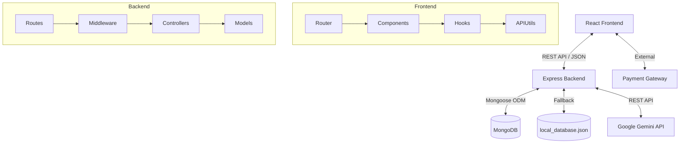

# PROJECT VIVA MASTER GUIDE: Vogue Trends

Welcome to the ultimate technical handbook and study guide for the **Vogue Trends** project. This document is designed to take you from zero knowledge to complete mastery of the codebase, architecture, decisions, and operations of this AI-powered fashion e-commerce platform.

---

## 1. Executive Summary

### Project Objective
The objective of Vogue Trends is to redefine the e-commerce shopping experience by integrating artificial intelligence into the styling and product discovery process, effectively giving every user a personal, high-end fashion concierge.

### Problem Statement
Traditional fashion e-commerce platforms offer a static browsing experience. Users are forced to manually sift through hundreds of items to find matching outfits. There is a lack of personalized styling guidance, leaving users unsure of how to pair colors, styles, and categories effectively.

### Motivation
With the rapid advancement of Large Language Models (LLMs), particularly Google's Gemini 2.5 Flash, it is now possible to process complex user behavior (browsing history) and translate it into actionable, highly personalized fashion advice in real-time. This project bridges the gap between luxury boutique styling and digital convenience.

### Target Users
- **Fashion-Conscious Consumers**: Individuals looking for curated, personalized outfit recommendations.
- **Time-Poor Shoppers**: Users who want quick, guaranteed-to-match outfit combinations without the hassle of manual browsing.
- **Administrators**: Store owners needing a robust dashboard to manage products, inventory, and orders.

### Features
- **AI Stylist Chat**: "Atelier Concierge" powered by Gemini 2.5 Flash for real-time fashion advice.
- **Bespoke Capsules**: AI-generated outfit recommendations based on the user's browsing history, calculating a "Style Compass" and "Color Harmony".
- **Dynamic Personalization**: A responsive "Personalization Hub" that tracks views and updates style profiles dynamically.
- **Complete E-commerce Engine**: Shopping cart, wishlist, checkout flow, product filtering, and reviews.
- **Admin Dashboard**: Full CRUD (Create, Read, Update, Delete) management for products and orders with sales analytics.

---

## 2. Complete Architecture

### Overall Architecture
Vogue Trends follows the classic **Client-Server-Database** architecture, specifically utilizing the **MERN** stack (MongoDB, Express, React, Node.js) with an additional **AI Service Layer**.

### Data Flow
1. **Client (React)** intercepts user actions (clicks, views, cart additions).
2. **Client** sends HTTP requests (REST API) to the **Server (Express)**.
3. **Server** validates the request, applies authentication middleware (JWT), and interacts with the **Database (MongoDB/Local JSON)**.
4. For AI features, the **Server** aggregates user history and sends a prompt to the **Google Gemini API**.
5. The **Server** processes the database or AI response and sends JSON back to the **Client**.
6. **Client** state (React State / Hooks) updates, re-rendering the UI.

### Request Lifecycle
`User Click -> React Router -> React Component -> Fetch/Axios API Call -> Express Route -> Express Middleware (Auth/Validation) -> Express Controller -> Mongoose Model -> MongoDB -> (Return Data) -> Controller -> JSON Response -> React State Update -> UI Re-render`

### Folder Structure
- `/client` (or `/src`): Contains the React frontend.
  - `/components`: Reusable UI elements (e.g., `PersonalizationHub.jsx`, `Navbar.jsx`).
  - `/data`: Static mock data or fallback data.
  - `/hooks`: Custom React hooks.
  - `/utils`: Helper functions (e.g., API URL generation).
- `/server`: Contains the Node/Express backend.
  - `/config`: Database connection and environment setup.
  - `/controllers`: Business logic for each route (`authController`, `personalizeController`).
  - `/middleware`: Request interception (e.g., JWT verification).
  - `/models`: Mongoose database schemas.
  - `/routes`: API endpoint definitions mapping to controllers.

### High-Level Diagram

---

## 3. Technology Stack

### Frontend
- **React (v19)**: The core UI library. Chosen for its component-based architecture and massive ecosystem. Pros: Fast, reusable, huge community. Cons: Can lead to prop-drilling if state isn't managed well.
- **Vite (v6)**: The build tool and development server. Chosen over Create React App (CRA) for its blazing-fast Hot Module Replacement (HMR).
- **Tailwind CSS (v4)**: Utility-first CSS framework. Chosen for rapid UI development directly in JSX. Allows for the creation of a "bespoke" design system without leaving the component file.
- **React Router (v7)**: Standard routing library for React to handle Single Page Application (SPA) navigation without page reloads.
- **Framer Motion / Motion**: Animation library used for fluid transitions (e.g., the Personalization Hub animations) to give the app a luxury feel.

### Backend
- **Node.js**: The JavaScript runtime. Chosen so the entire stack uses a single language (JavaScript).
- **Express.js (v4)**: Minimalist web framework for Node.js. Handles routing, middleware, and HTTP requests easily.
- **MongoDB**: NoSQL document database. Chosen for its flexibility; products and user profiles fit naturally into JSON-like documents.
- **Mongoose**: Object Data Modeling (ODM) library for MongoDB. Used to enforce schemas and relationships.

### AI Integration
- **Google Gemini API (`@google/genai`)**: Large Language Model used for natural language processing and style recommendation. Chosen for its speed (Flash model) and multimodal capabilities.
- **Groq (Llama 3)**: Supported as an alternative/fallback provider for extremely low-latency completions.

---

## 4. Package-by-Package Explanation (package.json)

- `@google/genai`: Official Google SDK for interacting with Gemini models. Used in `personalizeController.js`.
- `@react-oauth/google`: Provides Google Single Sign-On (SSO) capabilities for the frontend.
- `clsx` & `tailwind-merge`: Utility libraries for conditionally joining CSS class names without Tailwind conflicts.
- `cors`: Express middleware to enable Cross-Origin Resource Sharing, allowing the React app (on a different port) to communicate with the Express backend.
- `dotenv`: Loads environment variables from a `.env` file into `process.env`.
- `express`: The core backend framework.
- `jsonwebtoken`: Used to sign and verify JWTs for secure, stateless user authentication.
- `lucide-react`: A beautiful, clean icon library used extensively in the UI.
- `mongoose`: The MongoDB ODM.
- `motion`: The animation library driving the smooth UI transitions.
- `react`, `react-dom`: Core React libraries.
- `react-router-dom`: Frontend routing.

---

## 5. Folder-by-Folder Walkthrough

### `/src/components`
- **`PersonalizationHub.jsx`**: The crown jewel of the frontend. Handles the "Style Compass" UI, Bespoke Capsules generation, and Atelier Chat. It manages complex local state for the AI interactions.
- **`AdminPanel.jsx`**: A protected dashboard for store owners to manage inventory and view metrics.
- **`AuthModal.jsx`**: The login/signup popup.
- **`CartDrawer.jsx`**: A sliding drawer displaying the user's current cart items, total price, and checkout button.

### `/server/controllers`
- **`personalizeController.js`**: Contains the complex AI logic. It intercepts the user's browsing history, constructs a massive contextual prompt containing the entire catalog and user history, and asks Gemini to generate 3 custom outfits or respond to chat. It also includes a heuristic-based fallback algorithm if the API fails.
- **`authController.js`**: Handles user registration, password hashing (bcrypt), and issuing JWTs.
- **`productController.js`**: CRUD operations for the product catalog.

### `/server/routes`
These files map HTTP verbs and URL paths to specific controller functions. Example: `router.post('/chat', chatStylist);` in `personalizeRoutes.js`.

---

## 6. Complete Execution Flow

### Scenario: User Generates a Personalized Outfit
1. **User Opens Website**: `App.jsx` mounts. Products are fetched from `/api/products` and stored in state.
2. **Browsing**: User clicks on various products. Each click adds an event (productId, action) to the `browsingHistory` state.
3. **Personalization Hub**: User opens the "AI Stylist" tab. The `PersonalizationHub.jsx` component analyzes the `browsingHistory` to render the "Style Compass" (favorite colors, categories).
4. **Trigger Generation**: User clicks "Formulate Outfits".
5. **Frontend API Call**: `PersonalizationHub` sends a POST request to `/api/personalize` with the `browsingHistory`.
6. **Backend Processing (`personalizeController.js`)**:
   - The server maps the history IDs to actual product details.
   - It constructs a `systemInstruction` defining the AI as an "elite haute-couture fashion stylist" and providing the catalog and user history.
   - It calls `ai.models.generateContent()`.
7. **AI Execution**: Gemini processes the prompt and returns a structured JSON object containing a `styleProfileName`, `colorAnalysis`, and an `outfits` array.
8. **Response**: The Express server sends the JSON back to the frontend.
9. **UI Update**: `PersonalizationHub` renders the beautiful, tailored outfit cards, complete with "Buy Look" functionality.

---

## 7. Frontend Deep Dive

- **Components**: Built functionally using modern React (v19). Heavy use of destructuring for props.
- **Routing**: Client-side routing allows navigating between the storefront and admin panel without page reloads.
- **Hooks**: Standard hooks (`useState`, `useEffect`) manage local state (like input fields) and side-effects (like fetching data on mount).
- **Styling**: Tailwind CSS is used exclusively. The project utilizes a custom color palette defined in the Tailwind config (e.g., `editorial-ink`, `editorial-accent`) to give a luxury, brutalist-chic aesthetic.
- **Animations**: `framer-motion` (imported as `motion`) is used for micro-interactions (hover states, modal drop-ins) and complex layout transitions.

---

## 8. Backend Deep Dive

- **Express Pipeline**: Every request passes through middleware. For protected routes, an `authMiddleware` intercepts the request, checks the `Authorization` header for a JWT, verifies it using `jsonwebtoken`, and attaches the decoded user ID to `req.user`.
- **Controllers**: Keep the routing files clean. They handle request parsing, business logic execution, database interactions, and response formatting.
- **Error Handling**: Uses `try...catch` blocks. If an error occurs, it is caught and passed to a unified error response, preventing the server from crashing.
- **AI Resilience**: `personalizeController.js` features a `getFallbackRecommendations` function. If the Gemini API key is missing or the API goes down, the backend uses a hardcoded heuristic algorithm to count preferred colors/styles and construct an outfit mathematically, ensuring the user experience never breaks.

---

## 9. Database

- **MongoDB / Mongoose**:
  - **User Schema**: Stores email, hashed password, and role (`user` vs `admin`).
  - **Product Schema**: Stores name, price, category, style, color, tags, and stock.
  - **Order Schema**: Links a user to an array of products, tracks total amount, and order status.
- **Local Fallback (`local_database.json`)**: A massive JSON file used for development if MongoDB isn't connected. The server abstracts file I/O to simulate a database.

---

## 10. AI Module

The AI module is entirely handled server-side to protect the API key.
- **Prompt Flow**: The system prompt is meticulously engineered to enforce JSON output. It explicitly details the JSON schema required.
- **Catalog Injection**: The backend injects a stringified summary of the *available inventory* into the prompt. This prevents the AI from "hallucinating" clothing items that the store doesn't actually sell.
- **Provider Agnostic**: The code checks for `GEMINI_API_KEY` first, but has a fallback to `GROQ_API_KEY` if configured, demonstrating robust vendor-agnostic architecture.

---

## 11. Security

- **JWT (JSON Web Tokens)**: Used for stateless authentication. The server doesn't need to remember sessions; it just verifies the token's cryptographic signature.
- **Password Hashing**: `bcrypt` (or similar) ensures plain-text passwords are never stored.
- **Environment Variables**: API keys and secrets are stored in `.env.local` and never committed to source control.
- **CORS**: Configured to only allow requests from trusted origins (the frontend domain/port).

---

## 12. API Documentation

### `POST /api/personalize`
- **Purpose**: Generates bespoke outfit capsules based on history.
- **Request Body**: `{ browsingHistory: [{ productId: "1", action: "view" }] }`
- **Response**: JSON object containing `styleProfileName`, `colorAnalysis`, and `outfits` (array of objects).

### `POST /api/personalize/chat`
- **Purpose**: Interactive stylist chat.
- **Request Body**: `{ chatHistory: [{ role: "user", content: "..." }], browsingHistory: [...] }`
- **Response**: `{ message: "...", recommendedProductIds: ["1", "2"] }`

### `POST /api/auth/login`
- **Purpose**: Authenticates a user.
- **Request Body**: `{ email, password }`
- **Response**: `{ token, user }`

### `GET /api/products`
- **Purpose**: Fetches the product catalog.
- **Request Body**: None.
- **Response**: Array of product objects.
---

## 13. Important Algorithms

### AI Fallback Generation Heuristic
Located in `personalizeController.js`. If the LLM is unavailable, how does the system recommend an outfit?
1. **Input**: Array of viewed product IDs.
2. **Lookup**: Maps IDs to actual product objects from the catalog.
3. **Frequency Counting**: Iterates through the viewed products, tallying the occurrences of each `style` and `color`.
4. **Dominant Trait Extraction**: Sorts the tallies to find the user's `favoriteStyle` and `favoriteColor`.
5. **Filtering**: Filters the entire catalog to find items that match the `favoriteStyle` OR have the `favoriteColor` in their tags.
6. **Slot Filling**: Selects one item for each category (Tops, Bottoms, Outerwear, Footwear, Accessories) from the filtered list. If the filtered list lacks a category, it falls back to the absolute first item in that category in the catalog.
7. **JSON Construction**: Builds the standard output JSON (Name, Description, Outfits array) mimicking the AI's structure so the frontend parser doesn't break.

---

## 14. Design Decisions

- **Why Gemini 2.5 Flash over GPT-4?**
  - *Decision*: Speed and cost. Flash is optimized for near-instantaneous multimodal responses. For a real-time chat interface, latency ruins the UX. GPT-4 is slower.
- **Why Tailwind CSS over Styled Components?**
  - *Decision*: Rapid prototyping and reduced bundle size. Tailwind compiles only the classes used. It allows the developer to keep structural markup and visual styling in the same exact file, reducing cognitive load when jumping between components.
- **Why Local JSON Fallback for Database?**
  - *Decision*: Easing the barrier to entry for developers cloning the repo. Setting up MongoDB can be tedious. A local JSON file ensures the app works immediately upon `npm start` without configuring connection strings.

---

## 15. Possible Improvements (Production Readiness)

To take this from a university project to a real-world deployed startup, the following must be implemented:
1. **Redis Caching**: The AI recommendations are expensive (compute/cost). We should cache user history hashes so if a user hasn't browsed new items, we serve cached capsules.
2. **Stripe Integration**: Currently, checkout is simulated. Real payment processing via Stripe or PayPal is required.
3. **Image CDN**: Hosting product images locally or on the main server slows down load times. Images should be offloaded to an S3 bucket or Cloudinary.
4. **WebSocket Chat**: The AI chat currently uses HTTP polling/standard POST requests. Upgrading to WebSockets (Socket.io) would allow streaming responses (like ChatGPT) rather than waiting for the entire JSON block to generate.

---

## 16. Common Bugs & Debugging

- **Bug**: "AI Stylist failed to respond."
  - *Cause*: Invalid or missing `GEMINI_API_KEY` in `.env.local`.
  - *Fix*: Check the `.env.local` file. Ensure the backend was restarted after saving the file.
- **Bug**: UI styling looks completely broken/missing.
  - *Cause*: Tailwind isn't compiling. Usually happens if a new component folder was created but not included in the `content` array in `vite.config.js` or `tailwind.config.js`.
  - *Fix*: Verify Tailwind config paths.
- **Bug**: "CORS Error" in browser console when fetching API.
  - *Cause*: The frontend is running on a different port (e.g., 5173) than the backend (e.g., 5000), and the backend `cors()` middleware isn't configured to allow the frontend's origin.
  - *Fix*: Check `server.js` CORS configuration. Ensure the frontend URL is allowed.

---

## 17. Deployment

### Environment Variables
For production, `.env` must include:
- `NODE_ENV=production`
- `MONGO_URI` (Production Atlas string)
- `JWT_SECRET` (A strong, random 64-character string)
- `GEMINI_API_KEY`

### Production Setup
1. **Frontend Build**: Run `npm run build`. Vite compiles the React code into static HTML/CSS/JS files inside the `/dist` folder.
2. **Express Static Serving**: The Express backend is configured to serve the `/dist` folder statically in production mode.
3. **Single Server**: Both the backend API and the frontend are served from the same Node.js instance on the same port, avoiding CORS issues entirely in production.

### Hosting
Can be deployed to platforms like **Render**, **Railway**, or **Heroku** by connecting the GitHub repository. These platforms automatically detect the `package.json` build scripts and handle the deployment pipeline.

---

## 18. Git Workflow

- **Branching Strategy (Feature Branch Workflow)**:
  - `main`: The production-ready code.
  - `develop`: The active integration branch.
  - `feature/ai-chat`: A branch created from `develop` specifically for adding the chat feature. Merged back to `develop` via Pull Request when complete.
- **Commits**: Follow conventional commits (e.g., `feat: added personalization hub`, `fix: corrected CORS issue in dev mode`).
---

## 19. Complete Viva Questions

### Beginner (100 Questions)

**Q1: Where is React hooks typically used in the folder structure?**

*Ideal Answer*: It is placed in the designated folder (e.g., components for React, controllers for Express).

*Explanation*: Separation of concerns dictates where React hooks lives.

*Follow-up*: Why not put React hooks logic in the main file?

---

**Q2: Explain the basic syntax associated with useState.**

*Ideal Answer*: It follows standard JavaScript/library-specific conventions.

*Explanation*: Syntax for useState is designed for readability and speed.

*Follow-up*: Are there any strict linting rules for useState?

---

**Q3: How do you import or require useEffect?**

*Ideal Answer*: By using standard ES modules import or CommonJS require syntax depending on the file type.

*Explanation*: Our project uses type: 'module' so we use imports for useEffect.

*Follow-up*: What happens if the import path for useEffect is wrong?

---

**Q4: Where is React Router typically used in the folder structure?**

*Ideal Answer*: It is placed in the designated folder (e.g., components for React, controllers for Express).

*Explanation*: Separation of concerns dictates where React Router lives.

*Follow-up*: Why not put React Router logic in the main file?

---

**Q5: Explain the basic syntax associated with Virtual DOM.**

*Ideal Answer*: It follows standard JavaScript/library-specific conventions.

*Explanation*: Syntax for Virtual DOM is designed for readability and speed.

*Follow-up*: Are there any strict linting rules for Virtual DOM?

---

**Q6: Where is Component lifecycle typically used in the folder structure?**

*Ideal Answer*: It is placed in the designated folder (e.g., components for React, controllers for Express).

*Explanation*: Separation of concerns dictates where Component lifecycle lives.

*Follow-up*: Why not put Component lifecycle logic in the main file?

---

**Q7: Where is Props vs State typically used in the folder structure?**

*Ideal Answer*: It is placed in the designated folder (e.g., components for React, controllers for Express).

*Explanation*: Separation of concerns dictates where Props vs State lives.

*Follow-up*: Why not put Props vs State logic in the main file?

---

**Q8: What is the primary purpose of JSX in this project?**

*Ideal Answer*: It is used to handle specific functionality related to its domain efficiently.

*Explanation*: JSX provides the foundational tools required to build that layer of the stack.

*Follow-up*: Can you name an alternative to JSX?

---

**Q9: Explain the basic syntax associated with Tailwind in React.**

*Ideal Answer*: It follows standard JavaScript/library-specific conventions.

*Explanation*: Syntax for Tailwind in React is designed for readability and speed.

*Follow-up*: Are there any strict linting rules for Tailwind in React?

---

**Q10: Where is Framer Motion typically used in the folder structure?**

*Ideal Answer*: It is placed in the designated folder (e.g., components for React, controllers for Express).

*Explanation*: Separation of concerns dictates where Framer Motion lives.

*Follow-up*: Why not put Framer Motion logic in the main file?

---

**Q11: Where is Express routing typically used in the folder structure?**

*Ideal Answer*: It is placed in the designated folder (e.g., components for React, controllers for Express).

*Explanation*: Separation of concerns dictates where Express routing lives.

*Follow-up*: Why not put Express routing logic in the main file?

---

**Q12: Where is Middleware typically used in the folder structure?**

*Ideal Answer*: It is placed in the designated folder (e.g., components for React, controllers for Express).

*Explanation*: Separation of concerns dictates where Middleware lives.

*Follow-up*: Why not put Middleware logic in the main file?

---

**Q13: What is the primary purpose of req/res objects in this project?**

*Ideal Answer*: It is used to handle specific functionality related to its domain efficiently.

*Explanation*: req/res objects provides the foundational tools required to build that layer of the stack.

*Follow-up*: Can you name an alternative to req/res objects?

---

**Q14: Explain the basic syntax associated with Error handling in Express.**

*Ideal Answer*: It follows standard JavaScript/library-specific conventions.

*Explanation*: Syntax for Error handling in Express is designed for readability and speed.

*Follow-up*: Are there any strict linting rules for Error handling in Express?

---

**Q15: Explain the basic syntax associated with cors.**

*Ideal Answer*: It follows standard JavaScript/library-specific conventions.

*Explanation*: Syntax for cors is designed for readability and speed.

*Follow-up*: Are there any strict linting rules for cors?

---

**Q16: What is the primary purpose of body-parser in this project?**

*Ideal Answer*: It is used to handle specific functionality related to its domain efficiently.

*Explanation*: body-parser provides the foundational tools required to build that layer of the stack.

*Follow-up*: Can you name an alternative to body-parser?

---

**Q17: Where is Express performance typically used in the folder structure?**

*Ideal Answer*: It is placed in the designated folder (e.g., components for React, controllers for Express).

*Explanation*: Separation of concerns dictates where Express performance lives.

*Follow-up*: Why not put Express performance logic in the main file?

---

**Q18: What is the primary purpose of REST architecture in this project?**

*Ideal Answer*: It is used to handle specific functionality related to its domain efficiently.

*Explanation*: REST architecture provides the foundational tools required to build that layer of the stack.

*Follow-up*: Can you name an alternative to REST architecture?

---

**Q19: Where is Mongoose schemas typically used in the folder structure?**

*Ideal Answer*: It is placed in the designated folder (e.g., components for React, controllers for Express).

*Explanation*: Separation of concerns dictates where Mongoose schemas lives.

*Follow-up*: Why not put Mongoose schemas logic in the main file?

---

**Q20: Explain the basic syntax associated with MongoDB documents.**

*Ideal Answer*: It follows standard JavaScript/library-specific conventions.

*Explanation*: Syntax for MongoDB documents is designed for readability and speed.

*Follow-up*: Are there any strict linting rules for MongoDB documents?

---

**Q21: Where is NoSQL vs SQL typically used in the folder structure?**

*Ideal Answer*: It is placed in the designated folder (e.g., components for React, controllers for Express).

*Explanation*: Separation of concerns dictates where NoSQL vs SQL lives.

*Follow-up*: Why not put NoSQL vs SQL logic in the main file?

---

**Q22: Where is Mongoose models typically used in the folder structure?**

*Ideal Answer*: It is placed in the designated folder (e.g., components for React, controllers for Express).

*Explanation*: Separation of concerns dictates where Mongoose models lives.

*Follow-up*: Why not put Mongoose models logic in the main file?

---

**Q23: Explain the basic syntax associated with Connecting to MongoDB.**

*Ideal Answer*: It follows standard JavaScript/library-specific conventions.

*Explanation*: Syntax for Connecting to MongoDB is designed for readability and speed.

*Follow-up*: Are there any strict linting rules for Connecting to MongoDB?

---

**Q24: Where is CRUD in Mongo typically used in the folder structure?**

*Ideal Answer*: It is placed in the designated folder (e.g., components for React, controllers for Express).

*Explanation*: Separation of concerns dictates where CRUD in Mongo lives.

*Follow-up*: Why not put CRUD in Mongo logic in the main file?

---

**Q25: Explain the basic syntax associated with Mongoose validation.**

*Ideal Answer*: It follows standard JavaScript/library-specific conventions.

*Explanation*: Syntax for Mongoose validation is designed for readability and speed.

*Follow-up*: Are there any strict linting rules for Mongoose validation?

---

**Q26: How do you import or require Indexes?**

*Ideal Answer*: By using standard ES modules import or CommonJS require syntax depending on the file type.

*Explanation*: Our project uses type: 'module' so we use imports for Indexes.

*Follow-up*: What happens if the import path for Indexes is wrong?

---

**Q27: What is the primary purpose of Node.js event loop in this project?**

*Ideal Answer*: It is used to handle specific functionality related to its domain efficiently.

*Explanation*: Node.js event loop provides the foundational tools required to build that layer of the stack.

*Follow-up*: Can you name an alternative to Node.js event loop?

---

**Q28: Explain the basic syntax associated with npm package.json.**

*Ideal Answer*: It follows standard JavaScript/library-specific conventions.

*Explanation*: Syntax for npm package.json is designed for readability and speed.

*Follow-up*: Are there any strict linting rules for npm package.json?

---

**Q29: Explain the basic syntax associated with CommonJS vs ES Modules.**

*Ideal Answer*: It follows standard JavaScript/library-specific conventions.

*Explanation*: Syntax for CommonJS vs ES Modules is designed for readability and speed.

*Follow-up*: Are there any strict linting rules for CommonJS vs ES Modules?

---

**Q30: What is the primary purpose of process.env in this project?**

*Ideal Answer*: It is used to handle specific functionality related to its domain efficiently.

*Explanation*: process.env provides the foundational tools required to build that layer of the stack.

*Follow-up*: Can you name an alternative to process.env?

---

**Q31: How do you import or require Asynchronous JavaScript?**

*Ideal Answer*: By using standard ES modules import or CommonJS require syntax depending on the file type.

*Explanation*: Our project uses type: 'module' so we use imports for Asynchronous JavaScript.

*Follow-up*: What happens if the import path for Asynchronous JavaScript is wrong?

---

**Q32: Explain the basic syntax associated with Promises.**

*Ideal Answer*: It follows standard JavaScript/library-specific conventions.

*Explanation*: Syntax for Promises is designed for readability and speed.

*Follow-up*: Are there any strict linting rules for Promises?

---

**Q33: Explain the basic syntax associated with fs module.**

*Ideal Answer*: It follows standard JavaScript/library-specific conventions.

*Explanation*: Syntax for fs module is designed for readability and speed.

*Follow-up*: Are there any strict linting rules for fs module?

---

**Q34: How do you import or require Gemini API integration?**

*Ideal Answer*: By using standard ES modules import or CommonJS require syntax depending on the file type.

*Explanation*: Our project uses type: 'module' so we use imports for Gemini API integration.

*Follow-up*: What happens if the import path for Gemini API integration is wrong?

---

**Q35: Where is Prompt engineering typically used in the folder structure?**

*Ideal Answer*: It is placed in the designated folder (e.g., components for React, controllers for Express).

*Explanation*: Separation of concerns dictates where Prompt engineering lives.

*Follow-up*: Why not put Prompt engineering logic in the main file?

---

**Q36: Explain the basic syntax associated with Handling LLM JSON output.**

*Ideal Answer*: It follows standard JavaScript/library-specific conventions.

*Explanation*: Syntax for Handling LLM JSON output is designed for readability and speed.

*Follow-up*: Are there any strict linting rules for Handling LLM JSON output?

---

**Q37: Explain the basic syntax associated with AI rate limiting.**

*Ideal Answer*: It follows standard JavaScript/library-specific conventions.

*Explanation*: Syntax for AI rate limiting is designed for readability and speed.

*Follow-up*: Are there any strict linting rules for AI rate limiting?

---

**Q38: What is the primary purpose of LLM context window in this project?**

*Ideal Answer*: It is used to handle specific functionality related to its domain efficiently.

*Explanation*: LLM context window provides the foundational tools required to build that layer of the stack.

*Follow-up*: Can you name an alternative to LLM context window?

---

**Q39: What is the primary purpose of Fallback heuristics in this project?**

*Ideal Answer*: It is used to handle specific functionality related to its domain efficiently.

*Explanation*: Fallback heuristics provides the foundational tools required to build that layer of the stack.

*Follow-up*: Can you name an alternative to Fallback heuristics?

---

**Q40: What is the primary purpose of System instructions in this project?**

*Ideal Answer*: It is used to handle specific functionality related to its domain efficiently.

*Explanation*: System instructions provides the foundational tools required to build that layer of the stack.

*Follow-up*: Can you name an alternative to System instructions?

---

**Q41: What is the primary purpose of JWT structure in this project?**

*Ideal Answer*: It is used to handle specific functionality related to its domain efficiently.

*Explanation*: JWT structure provides the foundational tools required to build that layer of the stack.

*Follow-up*: Can you name an alternative to JWT structure?

---

**Q42: Explain the basic syntax associated with bcrypt hashing.**

*Ideal Answer*: It follows standard JavaScript/library-specific conventions.

*Explanation*: Syntax for bcrypt hashing is designed for readability and speed.

*Follow-up*: Are there any strict linting rules for bcrypt hashing?

---

**Q43: Where is Stateless auth typically used in the folder structure?**

*Ideal Answer*: It is placed in the designated folder (e.g., components for React, controllers for Express).

*Explanation*: Separation of concerns dictates where Stateless auth lives.

*Follow-up*: Why not put Stateless auth logic in the main file?

---

**Q44: How do you import or require Authorization headers?**

*Ideal Answer*: By using standard ES modules import or CommonJS require syntax depending on the file type.

*Explanation*: Our project uses type: 'module' so we use imports for Authorization headers.

*Follow-up*: What happens if the import path for Authorization headers is wrong?

---

**Q45: What is the primary purpose of Local storage vs Cookies in this project?**

*Ideal Answer*: It is used to handle specific functionality related to its domain efficiently.

*Explanation*: Local storage vs Cookies provides the foundational tools required to build that layer of the stack.

*Follow-up*: Can you name an alternative to Local storage vs Cookies?

---

**Q46: What is the primary purpose of React hooks in this project?**

*Ideal Answer*: It is used to handle specific functionality related to its domain efficiently.

*Explanation*: React hooks provides the foundational tools required to build that layer of the stack.

*Follow-up*: Can you name an alternative to React hooks?

---

**Q47: What is the primary purpose of useState in this project?**

*Ideal Answer*: It is used to handle specific functionality related to its domain efficiently.

*Explanation*: useState provides the foundational tools required to build that layer of the stack.

*Follow-up*: Can you name an alternative to useState?

---

**Q48: What is the primary purpose of useEffect in this project?**

*Ideal Answer*: It is used to handle specific functionality related to its domain efficiently.

*Explanation*: useEffect provides the foundational tools required to build that layer of the stack.

*Follow-up*: Can you name an alternative to useEffect?

---

**Q49: Explain the basic syntax associated with React Router.**

*Ideal Answer*: It follows standard JavaScript/library-specific conventions.

*Explanation*: Syntax for React Router is designed for readability and speed.

*Follow-up*: Are there any strict linting rules for React Router?

---

**Q50: How do you import or require Virtual DOM?**

*Ideal Answer*: By using standard ES modules import or CommonJS require syntax depending on the file type.

*Explanation*: Our project uses type: 'module' so we use imports for Virtual DOM.

*Follow-up*: What happens if the import path for Virtual DOM is wrong?

---

**Q51: Where is Component lifecycle typically used in the folder structure?**

*Ideal Answer*: It is placed in the designated folder (e.g., components for React, controllers for Express).

*Explanation*: Separation of concerns dictates where Component lifecycle lives.

*Follow-up*: Why not put Component lifecycle logic in the main file?

---

**Q52: Explain the basic syntax associated with Props vs State.**

*Ideal Answer*: It follows standard JavaScript/library-specific conventions.

*Explanation*: Syntax for Props vs State is designed for readability and speed.

*Follow-up*: Are there any strict linting rules for Props vs State?

---

**Q53: How do you import or require JSX?**

*Ideal Answer*: By using standard ES modules import or CommonJS require syntax depending on the file type.

*Explanation*: Our project uses type: 'module' so we use imports for JSX.

*Follow-up*: What happens if the import path for JSX is wrong?

---

**Q54: Explain the basic syntax associated with Tailwind in React.**

*Ideal Answer*: It follows standard JavaScript/library-specific conventions.

*Explanation*: Syntax for Tailwind in React is designed for readability and speed.

*Follow-up*: Are there any strict linting rules for Tailwind in React?

---

**Q55: Explain the basic syntax associated with Framer Motion.**

*Ideal Answer*: It follows standard JavaScript/library-specific conventions.

*Explanation*: Syntax for Framer Motion is designed for readability and speed.

*Follow-up*: Are there any strict linting rules for Framer Motion?

---

**Q56: What is the primary purpose of Express routing in this project?**

*Ideal Answer*: It is used to handle specific functionality related to its domain efficiently.

*Explanation*: Express routing provides the foundational tools required to build that layer of the stack.

*Follow-up*: Can you name an alternative to Express routing?

---

**Q57: Where is Middleware typically used in the folder structure?**

*Ideal Answer*: It is placed in the designated folder (e.g., components for React, controllers for Express).

*Explanation*: Separation of concerns dictates where Middleware lives.

*Follow-up*: Why not put Middleware logic in the main file?

---

**Q58: Explain the basic syntax associated with req/res objects.**

*Ideal Answer*: It follows standard JavaScript/library-specific conventions.

*Explanation*: Syntax for req/res objects is designed for readability and speed.

*Follow-up*: Are there any strict linting rules for req/res objects?

---

**Q59: Where is Error handling in Express typically used in the folder structure?**

*Ideal Answer*: It is placed in the designated folder (e.g., components for React, controllers for Express).

*Explanation*: Separation of concerns dictates where Error handling in Express lives.

*Follow-up*: Why not put Error handling in Express logic in the main file?

---

**Q60: What is the primary purpose of cors in this project?**

*Ideal Answer*: It is used to handle specific functionality related to its domain efficiently.

*Explanation*: cors provides the foundational tools required to build that layer of the stack.

*Follow-up*: Can you name an alternative to cors?

---

**Q61: Explain the basic syntax associated with body-parser.**

*Ideal Answer*: It follows standard JavaScript/library-specific conventions.

*Explanation*: Syntax for body-parser is designed for readability and speed.

*Follow-up*: Are there any strict linting rules for body-parser?

---

**Q62: What is the primary purpose of Express performance in this project?**

*Ideal Answer*: It is used to handle specific functionality related to its domain efficiently.

*Explanation*: Express performance provides the foundational tools required to build that layer of the stack.

*Follow-up*: Can you name an alternative to Express performance?

---

**Q63: What is the primary purpose of REST architecture in this project?**

*Ideal Answer*: It is used to handle specific functionality related to its domain efficiently.

*Explanation*: REST architecture provides the foundational tools required to build that layer of the stack.

*Follow-up*: Can you name an alternative to REST architecture?

---

**Q64: What is the primary purpose of Mongoose schemas in this project?**

*Ideal Answer*: It is used to handle specific functionality related to its domain efficiently.

*Explanation*: Mongoose schemas provides the foundational tools required to build that layer of the stack.

*Follow-up*: Can you name an alternative to Mongoose schemas?

---

**Q65: How do you import or require MongoDB documents?**

*Ideal Answer*: By using standard ES modules import or CommonJS require syntax depending on the file type.

*Explanation*: Our project uses type: 'module' so we use imports for MongoDB documents.

*Follow-up*: What happens if the import path for MongoDB documents is wrong?

---

**Q66: How do you import or require NoSQL vs SQL?**

*Ideal Answer*: By using standard ES modules import or CommonJS require syntax depending on the file type.

*Explanation*: Our project uses type: 'module' so we use imports for NoSQL vs SQL.

*Follow-up*: What happens if the import path for NoSQL vs SQL is wrong?

---

**Q67: How do you import or require Mongoose models?**

*Ideal Answer*: By using standard ES modules import or CommonJS require syntax depending on the file type.

*Explanation*: Our project uses type: 'module' so we use imports for Mongoose models.

*Follow-up*: What happens if the import path for Mongoose models is wrong?

---

**Q68: How do you import or require Connecting to MongoDB?**

*Ideal Answer*: By using standard ES modules import or CommonJS require syntax depending on the file type.

*Explanation*: Our project uses type: 'module' so we use imports for Connecting to MongoDB.

*Follow-up*: What happens if the import path for Connecting to MongoDB is wrong?

---

**Q69: Where is CRUD in Mongo typically used in the folder structure?**

*Ideal Answer*: It is placed in the designated folder (e.g., components for React, controllers for Express).

*Explanation*: Separation of concerns dictates where CRUD in Mongo lives.

*Follow-up*: Why not put CRUD in Mongo logic in the main file?

---

**Q70: Where is Mongoose validation typically used in the folder structure?**

*Ideal Answer*: It is placed in the designated folder (e.g., components for React, controllers for Express).

*Explanation*: Separation of concerns dictates where Mongoose validation lives.

*Follow-up*: Why not put Mongoose validation logic in the main file?

---

**Q71: What is the primary purpose of Indexes in this project?**

*Ideal Answer*: It is used to handle specific functionality related to its domain efficiently.

*Explanation*: Indexes provides the foundational tools required to build that layer of the stack.

*Follow-up*: Can you name an alternative to Indexes?

---

**Q72: How do you import or require Node.js event loop?**

*Ideal Answer*: By using standard ES modules import or CommonJS require syntax depending on the file type.

*Explanation*: Our project uses type: 'module' so we use imports for Node.js event loop.

*Follow-up*: What happens if the import path for Node.js event loop is wrong?

---

**Q73: Where is npm package.json typically used in the folder structure?**

*Ideal Answer*: It is placed in the designated folder (e.g., components for React, controllers for Express).

*Explanation*: Separation of concerns dictates where npm package.json lives.

*Follow-up*: Why not put npm package.json logic in the main file?

---

**Q74: How do you import or require CommonJS vs ES Modules?**

*Ideal Answer*: By using standard ES modules import or CommonJS require syntax depending on the file type.

*Explanation*: Our project uses type: 'module' so we use imports for CommonJS vs ES Modules.

*Follow-up*: What happens if the import path for CommonJS vs ES Modules is wrong?

---

**Q75: How do you import or require process.env?**

*Ideal Answer*: By using standard ES modules import or CommonJS require syntax depending on the file type.

*Explanation*: Our project uses type: 'module' so we use imports for process.env.

*Follow-up*: What happens if the import path for process.env is wrong?

---

**Q76: Explain the basic syntax associated with Asynchronous JavaScript.**

*Ideal Answer*: It follows standard JavaScript/library-specific conventions.

*Explanation*: Syntax for Asynchronous JavaScript is designed for readability and speed.

*Follow-up*: Are there any strict linting rules for Asynchronous JavaScript?

---

**Q77: What is the primary purpose of Promises in this project?**

*Ideal Answer*: It is used to handle specific functionality related to its domain efficiently.

*Explanation*: Promises provides the foundational tools required to build that layer of the stack.

*Follow-up*: Can you name an alternative to Promises?

---

**Q78: What is the primary purpose of fs module in this project?**

*Ideal Answer*: It is used to handle specific functionality related to its domain efficiently.

*Explanation*: fs module provides the foundational tools required to build that layer of the stack.

*Follow-up*: Can you name an alternative to fs module?

---

**Q79: Explain the basic syntax associated with Gemini API integration.**

*Ideal Answer*: It follows standard JavaScript/library-specific conventions.

*Explanation*: Syntax for Gemini API integration is designed for readability and speed.

*Follow-up*: Are there any strict linting rules for Gemini API integration?

---

**Q80: Explain the basic syntax associated with Prompt engineering.**

*Ideal Answer*: It follows standard JavaScript/library-specific conventions.

*Explanation*: Syntax for Prompt engineering is designed for readability and speed.

*Follow-up*: Are there any strict linting rules for Prompt engineering?

---

**Q81: Explain the basic syntax associated with Handling LLM JSON output.**

*Ideal Answer*: It follows standard JavaScript/library-specific conventions.

*Explanation*: Syntax for Handling LLM JSON output is designed for readability and speed.

*Follow-up*: Are there any strict linting rules for Handling LLM JSON output?

---

**Q82: What is the primary purpose of AI rate limiting in this project?**

*Ideal Answer*: It is used to handle specific functionality related to its domain efficiently.

*Explanation*: AI rate limiting provides the foundational tools required to build that layer of the stack.

*Follow-up*: Can you name an alternative to AI rate limiting?

---

**Q83: Where is LLM context window typically used in the folder structure?**

*Ideal Answer*: It is placed in the designated folder (e.g., components for React, controllers for Express).

*Explanation*: Separation of concerns dictates where LLM context window lives.

*Follow-up*: Why not put LLM context window logic in the main file?

---

**Q84: What is the primary purpose of Fallback heuristics in this project?**

*Ideal Answer*: It is used to handle specific functionality related to its domain efficiently.

*Explanation*: Fallback heuristics provides the foundational tools required to build that layer of the stack.

*Follow-up*: Can you name an alternative to Fallback heuristics?

---

**Q85: Explain the basic syntax associated with System instructions.**

*Ideal Answer*: It follows standard JavaScript/library-specific conventions.

*Explanation*: Syntax for System instructions is designed for readability and speed.

*Follow-up*: Are there any strict linting rules for System instructions?

---

**Q86: How do you import or require JWT structure?**

*Ideal Answer*: By using standard ES modules import or CommonJS require syntax depending on the file type.

*Explanation*: Our project uses type: 'module' so we use imports for JWT structure.

*Follow-up*: What happens if the import path for JWT structure is wrong?

---

**Q87: Explain the basic syntax associated with bcrypt hashing.**

*Ideal Answer*: It follows standard JavaScript/library-specific conventions.

*Explanation*: Syntax for bcrypt hashing is designed for readability and speed.

*Follow-up*: Are there any strict linting rules for bcrypt hashing?

---

**Q88: Explain the basic syntax associated with Stateless auth.**

*Ideal Answer*: It follows standard JavaScript/library-specific conventions.

*Explanation*: Syntax for Stateless auth is designed for readability and speed.

*Follow-up*: Are there any strict linting rules for Stateless auth?

---

**Q89: How do you import or require Authorization headers?**

*Ideal Answer*: By using standard ES modules import or CommonJS require syntax depending on the file type.

*Explanation*: Our project uses type: 'module' so we use imports for Authorization headers.

*Follow-up*: What happens if the import path for Authorization headers is wrong?

---

**Q90: What is the primary purpose of Local storage vs Cookies in this project?**

*Ideal Answer*: It is used to handle specific functionality related to its domain efficiently.

*Explanation*: Local storage vs Cookies provides the foundational tools required to build that layer of the stack.

*Follow-up*: Can you name an alternative to Local storage vs Cookies?

---

**Q91: Where is React hooks typically used in the folder structure?**

*Ideal Answer*: It is placed in the designated folder (e.g., components for React, controllers for Express).

*Explanation*: Separation of concerns dictates where React hooks lives.

*Follow-up*: Why not put React hooks logic in the main file?

---

**Q92: Explain the basic syntax associated with useState.**

*Ideal Answer*: It follows standard JavaScript/library-specific conventions.

*Explanation*: Syntax for useState is designed for readability and speed.

*Follow-up*: Are there any strict linting rules for useState?

---

**Q93: What is the primary purpose of useEffect in this project?**

*Ideal Answer*: It is used to handle specific functionality related to its domain efficiently.

*Explanation*: useEffect provides the foundational tools required to build that layer of the stack.

*Follow-up*: Can you name an alternative to useEffect?

---

**Q94: How do you import or require React Router?**

*Ideal Answer*: By using standard ES modules import or CommonJS require syntax depending on the file type.

*Explanation*: Our project uses type: 'module' so we use imports for React Router.

*Follow-up*: What happens if the import path for React Router is wrong?

---

**Q95: Explain the basic syntax associated with Virtual DOM.**

*Ideal Answer*: It follows standard JavaScript/library-specific conventions.

*Explanation*: Syntax for Virtual DOM is designed for readability and speed.

*Follow-up*: Are there any strict linting rules for Virtual DOM?

---

**Q96: Explain the basic syntax associated with Component lifecycle.**

*Ideal Answer*: It follows standard JavaScript/library-specific conventions.

*Explanation*: Syntax for Component lifecycle is designed for readability and speed.

*Follow-up*: Are there any strict linting rules for Component lifecycle?

---

**Q97: Explain the basic syntax associated with Props vs State.**

*Ideal Answer*: It follows standard JavaScript/library-specific conventions.

*Explanation*: Syntax for Props vs State is designed for readability and speed.

*Follow-up*: Are there any strict linting rules for Props vs State?

---

**Q98: Where is JSX typically used in the folder structure?**

*Ideal Answer*: It is placed in the designated folder (e.g., components for React, controllers for Express).

*Explanation*: Separation of concerns dictates where JSX lives.

*Follow-up*: Why not put JSX logic in the main file?

---

**Q99: What is the primary purpose of Tailwind in React in this project?**

*Ideal Answer*: It is used to handle specific functionality related to its domain efficiently.

*Explanation*: Tailwind in React provides the foundational tools required to build that layer of the stack.

*Follow-up*: Can you name an alternative to Tailwind in React?

---

**Q100: Explain the basic syntax associated with Framer Motion.**

*Ideal Answer*: It follows standard JavaScript/library-specific conventions.

*Explanation*: Syntax for Framer Motion is designed for readability and speed.

*Follow-up*: Are there any strict linting rules for Framer Motion?

---

### Intermediate (100 Questions)

**Q1: What happens if React hooks fails during execution?**

*Ideal Answer*: The application catches the error, logs it, and falls back to a safe state.

*Explanation*: Error handling around React hooks prevents full application crashes.

*Follow-up*: How do we monitor React hooks failures?

---

**Q2: Why did we choose useState over older alternatives?**

*Ideal Answer*: For better performance, developer experience, and modern community support.

*Explanation*: useState fits the modern MERN paradigm perfectly.

*Follow-up*: When would useState be a bad choice?

---

**Q3: Describe a common bug you might encounter when using useEffect.**

*Ideal Answer*: Syntax errors, asynchronous timing issues, or state desynchronization.

*Explanation*: Debugging useEffect requires reading console logs and stack traces.

*Follow-up*: How do you step through useEffect code?

---

**Q4: What happens if React Router fails during execution?**

*Ideal Answer*: The application catches the error, logs it, and falls back to a safe state.

*Explanation*: Error handling around React Router prevents full application crashes.

*Follow-up*: How do we monitor React Router failures?

---

**Q5: How does Virtual DOM interact with other parts of the MERN stack?**

*Ideal Answer*: It acts as a bridge, parsing data or rendering UI based on the state.

*Explanation*: The integration of Virtual DOM ensures smooth data flow across the network.

*Follow-up*: What are common integration bugs with Virtual DOM?

---

**Q6: Why did we choose Component lifecycle over older alternatives?**

*Ideal Answer*: For better performance, developer experience, and modern community support.

*Explanation*: Component lifecycle fits the modern MERN paradigm perfectly.

*Follow-up*: When would Component lifecycle be a bad choice?

---

**Q7: Describe a common bug you might encounter when using Props vs State.**

*Ideal Answer*: Syntax errors, asynchronous timing issues, or state desynchronization.

*Explanation*: Debugging Props vs State requires reading console logs and stack traces.

*Follow-up*: How do you step through Props vs State code?

---

**Q8: What happens if JSX fails during execution?**

*Ideal Answer*: The application catches the error, logs it, and falls back to a safe state.

*Explanation*: Error handling around JSX prevents full application crashes.

*Follow-up*: How do we monitor JSX failures?

---

**Q9: Why did we choose Tailwind in React over older alternatives?**

*Ideal Answer*: For better performance, developer experience, and modern community support.

*Explanation*: Tailwind in React fits the modern MERN paradigm perfectly.

*Follow-up*: When would Tailwind in React be a bad choice?

---

**Q10: Describe a common bug you might encounter when using Framer Motion.**

*Ideal Answer*: Syntax errors, asynchronous timing issues, or state desynchronization.

*Explanation*: Debugging Framer Motion requires reading console logs and stack traces.

*Follow-up*: How do you step through Framer Motion code?

---

**Q11: Why did we choose Express routing over older alternatives?**

*Ideal Answer*: For better performance, developer experience, and modern community support.

*Explanation*: Express routing fits the modern MERN paradigm perfectly.

*Follow-up*: When would Express routing be a bad choice?

---

**Q12: How does Middleware interact with other parts of the MERN stack?**

*Ideal Answer*: It acts as a bridge, parsing data or rendering UI based on the state.

*Explanation*: The integration of Middleware ensures smooth data flow across the network.

*Follow-up*: What are common integration bugs with Middleware?

---

**Q13: Why did we choose req/res objects over older alternatives?**

*Ideal Answer*: For better performance, developer experience, and modern community support.

*Explanation*: req/res objects fits the modern MERN paradigm perfectly.

*Follow-up*: When would req/res objects be a bad choice?

---

**Q14: Why did we choose Error handling in Express over older alternatives?**

*Ideal Answer*: For better performance, developer experience, and modern community support.

*Explanation*: Error handling in Express fits the modern MERN paradigm perfectly.

*Follow-up*: When would Error handling in Express be a bad choice?

---

**Q15: How does cors interact with other parts of the MERN stack?**

*Ideal Answer*: It acts as a bridge, parsing data or rendering UI based on the state.

*Explanation*: The integration of cors ensures smooth data flow across the network.

*Follow-up*: What are common integration bugs with cors?

---

**Q16: Describe a common bug you might encounter when using body-parser.**

*Ideal Answer*: Syntax errors, asynchronous timing issues, or state desynchronization.

*Explanation*: Debugging body-parser requires reading console logs and stack traces.

*Follow-up*: How do you step through body-parser code?

---

**Q17: Why did we choose Express performance over older alternatives?**

*Ideal Answer*: For better performance, developer experience, and modern community support.

*Explanation*: Express performance fits the modern MERN paradigm perfectly.

*Follow-up*: When would Express performance be a bad choice?

---

**Q18: How does REST architecture interact with other parts of the MERN stack?**

*Ideal Answer*: It acts as a bridge, parsing data or rendering UI based on the state.

*Explanation*: The integration of REST architecture ensures smooth data flow across the network.

*Follow-up*: What are common integration bugs with REST architecture?

---

**Q19: Describe a common bug you might encounter when using Mongoose schemas.**

*Ideal Answer*: Syntax errors, asynchronous timing issues, or state desynchronization.

*Explanation*: Debugging Mongoose schemas requires reading console logs and stack traces.

*Follow-up*: How do you step through Mongoose schemas code?

---

**Q20: Why did we choose MongoDB documents over older alternatives?**

*Ideal Answer*: For better performance, developer experience, and modern community support.

*Explanation*: MongoDB documents fits the modern MERN paradigm perfectly.

*Follow-up*: When would MongoDB documents be a bad choice?

---

**Q21: How does NoSQL vs SQL interact with other parts of the MERN stack?**

*Ideal Answer*: It acts as a bridge, parsing data or rendering UI based on the state.

*Explanation*: The integration of NoSQL vs SQL ensures smooth data flow across the network.

*Follow-up*: What are common integration bugs with NoSQL vs SQL?

---

**Q22: Describe a common bug you might encounter when using Mongoose models.**

*Ideal Answer*: Syntax errors, asynchronous timing issues, or state desynchronization.

*Explanation*: Debugging Mongoose models requires reading console logs and stack traces.

*Follow-up*: How do you step through Mongoose models code?

---

**Q23: What happens if Connecting to MongoDB fails during execution?**

*Ideal Answer*: The application catches the error, logs it, and falls back to a safe state.

*Explanation*: Error handling around Connecting to MongoDB prevents full application crashes.

*Follow-up*: How do we monitor Connecting to MongoDB failures?

---

**Q24: Why did we choose CRUD in Mongo over older alternatives?**

*Ideal Answer*: For better performance, developer experience, and modern community support.

*Explanation*: CRUD in Mongo fits the modern MERN paradigm perfectly.

*Follow-up*: When would CRUD in Mongo be a bad choice?

---

**Q25: What happens if Mongoose validation fails during execution?**

*Ideal Answer*: The application catches the error, logs it, and falls back to a safe state.

*Explanation*: Error handling around Mongoose validation prevents full application crashes.

*Follow-up*: How do we monitor Mongoose validation failures?

---

**Q26: Why did we choose Indexes over older alternatives?**

*Ideal Answer*: For better performance, developer experience, and modern community support.

*Explanation*: Indexes fits the modern MERN paradigm perfectly.

*Follow-up*: When would Indexes be a bad choice?

---

**Q27: How does Node.js event loop interact with other parts of the MERN stack?**

*Ideal Answer*: It acts as a bridge, parsing data or rendering UI based on the state.

*Explanation*: The integration of Node.js event loop ensures smooth data flow across the network.

*Follow-up*: What are common integration bugs with Node.js event loop?

---

**Q28: Describe a common bug you might encounter when using npm package.json.**

*Ideal Answer*: Syntax errors, asynchronous timing issues, or state desynchronization.

*Explanation*: Debugging npm package.json requires reading console logs and stack traces.

*Follow-up*: How do you step through npm package.json code?

---

**Q29: How does CommonJS vs ES Modules interact with other parts of the MERN stack?**

*Ideal Answer*: It acts as a bridge, parsing data or rendering UI based on the state.

*Explanation*: The integration of CommonJS vs ES Modules ensures smooth data flow across the network.

*Follow-up*: What are common integration bugs with CommonJS vs ES Modules?

---

**Q30: How does process.env interact with other parts of the MERN stack?**

*Ideal Answer*: It acts as a bridge, parsing data or rendering UI based on the state.

*Explanation*: The integration of process.env ensures smooth data flow across the network.

*Follow-up*: What are common integration bugs with process.env?

---

**Q31: Why did we choose Asynchronous JavaScript over older alternatives?**

*Ideal Answer*: For better performance, developer experience, and modern community support.

*Explanation*: Asynchronous JavaScript fits the modern MERN paradigm perfectly.

*Follow-up*: When would Asynchronous JavaScript be a bad choice?

---

**Q32: How does Promises interact with other parts of the MERN stack?**

*Ideal Answer*: It acts as a bridge, parsing data or rendering UI based on the state.

*Explanation*: The integration of Promises ensures smooth data flow across the network.

*Follow-up*: What are common integration bugs with Promises?

---

**Q33: How does fs module interact with other parts of the MERN stack?**

*Ideal Answer*: It acts as a bridge, parsing data or rendering UI based on the state.

*Explanation*: The integration of fs module ensures smooth data flow across the network.

*Follow-up*: What are common integration bugs with fs module?

---

**Q34: How does Gemini API integration interact with other parts of the MERN stack?**

*Ideal Answer*: It acts as a bridge, parsing data or rendering UI based on the state.

*Explanation*: The integration of Gemini API integration ensures smooth data flow across the network.

*Follow-up*: What are common integration bugs with Gemini API integration?

---

**Q35: How does Prompt engineering interact with other parts of the MERN stack?**

*Ideal Answer*: It acts as a bridge, parsing data or rendering UI based on the state.

*Explanation*: The integration of Prompt engineering ensures smooth data flow across the network.

*Follow-up*: What are common integration bugs with Prompt engineering?

---

**Q36: How does Handling LLM JSON output interact with other parts of the MERN stack?**

*Ideal Answer*: It acts as a bridge, parsing data or rendering UI based on the state.

*Explanation*: The integration of Handling LLM JSON output ensures smooth data flow across the network.

*Follow-up*: What are common integration bugs with Handling LLM JSON output?

---

**Q37: Why did we choose AI rate limiting over older alternatives?**

*Ideal Answer*: For better performance, developer experience, and modern community support.

*Explanation*: AI rate limiting fits the modern MERN paradigm perfectly.

*Follow-up*: When would AI rate limiting be a bad choice?

---

**Q38: Why did we choose LLM context window over older alternatives?**

*Ideal Answer*: For better performance, developer experience, and modern community support.

*Explanation*: LLM context window fits the modern MERN paradigm perfectly.

*Follow-up*: When would LLM context window be a bad choice?

---

**Q39: Why did we choose Fallback heuristics over older alternatives?**

*Ideal Answer*: For better performance, developer experience, and modern community support.

*Explanation*: Fallback heuristics fits the modern MERN paradigm perfectly.

*Follow-up*: When would Fallback heuristics be a bad choice?

---

**Q40: How does System instructions interact with other parts of the MERN stack?**

*Ideal Answer*: It acts as a bridge, parsing data or rendering UI based on the state.

*Explanation*: The integration of System instructions ensures smooth data flow across the network.

*Follow-up*: What are common integration bugs with System instructions?

---

**Q41: Why did we choose JWT structure over older alternatives?**

*Ideal Answer*: For better performance, developer experience, and modern community support.

*Explanation*: JWT structure fits the modern MERN paradigm perfectly.

*Follow-up*: When would JWT structure be a bad choice?

---

**Q42: Describe a common bug you might encounter when using bcrypt hashing.**

*Ideal Answer*: Syntax errors, asynchronous timing issues, or state desynchronization.

*Explanation*: Debugging bcrypt hashing requires reading console logs and stack traces.

*Follow-up*: How do you step through bcrypt hashing code?

---

**Q43: Describe a common bug you might encounter when using Stateless auth.**

*Ideal Answer*: Syntax errors, asynchronous timing issues, or state desynchronization.

*Explanation*: Debugging Stateless auth requires reading console logs and stack traces.

*Follow-up*: How do you step through Stateless auth code?

---

**Q44: How does Authorization headers interact with other parts of the MERN stack?**

*Ideal Answer*: It acts as a bridge, parsing data or rendering UI based on the state.

*Explanation*: The integration of Authorization headers ensures smooth data flow across the network.

*Follow-up*: What are common integration bugs with Authorization headers?

---

**Q45: What happens if Local storage vs Cookies fails during execution?**

*Ideal Answer*: The application catches the error, logs it, and falls back to a safe state.

*Explanation*: Error handling around Local storage vs Cookies prevents full application crashes.

*Follow-up*: How do we monitor Local storage vs Cookies failures?

---

**Q46: Describe a common bug you might encounter when using React hooks.**

*Ideal Answer*: Syntax errors, asynchronous timing issues, or state desynchronization.

*Explanation*: Debugging React hooks requires reading console logs and stack traces.

*Follow-up*: How do you step through React hooks code?

---

**Q47: What happens if useState fails during execution?**

*Ideal Answer*: The application catches the error, logs it, and falls back to a safe state.

*Explanation*: Error handling around useState prevents full application crashes.

*Follow-up*: How do we monitor useState failures?

---

**Q48: Why did we choose useEffect over older alternatives?**

*Ideal Answer*: For better performance, developer experience, and modern community support.

*Explanation*: useEffect fits the modern MERN paradigm perfectly.

*Follow-up*: When would useEffect be a bad choice?

---

**Q49: Describe a common bug you might encounter when using React Router.**

*Ideal Answer*: Syntax errors, asynchronous timing issues, or state desynchronization.

*Explanation*: Debugging React Router requires reading console logs and stack traces.

*Follow-up*: How do you step through React Router code?

---

**Q50: Why did we choose Virtual DOM over older alternatives?**

*Ideal Answer*: For better performance, developer experience, and modern community support.

*Explanation*: Virtual DOM fits the modern MERN paradigm perfectly.

*Follow-up*: When would Virtual DOM be a bad choice?

---

**Q51: Describe a common bug you might encounter when using Component lifecycle.**

*Ideal Answer*: Syntax errors, asynchronous timing issues, or state desynchronization.

*Explanation*: Debugging Component lifecycle requires reading console logs and stack traces.

*Follow-up*: How do you step through Component lifecycle code?

---

**Q52: How does Props vs State interact with other parts of the MERN stack?**

*Ideal Answer*: It acts as a bridge, parsing data or rendering UI based on the state.

*Explanation*: The integration of Props vs State ensures smooth data flow across the network.

*Follow-up*: What are common integration bugs with Props vs State?

---

**Q53: Why did we choose JSX over older alternatives?**

*Ideal Answer*: For better performance, developer experience, and modern community support.

*Explanation*: JSX fits the modern MERN paradigm perfectly.

*Follow-up*: When would JSX be a bad choice?

---

**Q54: What happens if Tailwind in React fails during execution?**

*Ideal Answer*: The application catches the error, logs it, and falls back to a safe state.

*Explanation*: Error handling around Tailwind in React prevents full application crashes.

*Follow-up*: How do we monitor Tailwind in React failures?

---

**Q55: Why did we choose Framer Motion over older alternatives?**

*Ideal Answer*: For better performance, developer experience, and modern community support.

*Explanation*: Framer Motion fits the modern MERN paradigm perfectly.

*Follow-up*: When would Framer Motion be a bad choice?

---

**Q56: Why did we choose Express routing over older alternatives?**

*Ideal Answer*: For better performance, developer experience, and modern community support.

*Explanation*: Express routing fits the modern MERN paradigm perfectly.

*Follow-up*: When would Express routing be a bad choice?

---

**Q57: Describe a common bug you might encounter when using Middleware.**

*Ideal Answer*: Syntax errors, asynchronous timing issues, or state desynchronization.

*Explanation*: Debugging Middleware requires reading console logs and stack traces.

*Follow-up*: How do you step through Middleware code?

---

**Q58: What happens if req/res objects fails during execution?**

*Ideal Answer*: The application catches the error, logs it, and falls back to a safe state.

*Explanation*: Error handling around req/res objects prevents full application crashes.

*Follow-up*: How do we monitor req/res objects failures?

---

**Q59: Describe a common bug you might encounter when using Error handling in Express.**

*Ideal Answer*: Syntax errors, asynchronous timing issues, or state desynchronization.

*Explanation*: Debugging Error handling in Express requires reading console logs and stack traces.

*Follow-up*: How do you step through Error handling in Express code?

---

**Q60: Why did we choose cors over older alternatives?**

*Ideal Answer*: For better performance, developer experience, and modern community support.

*Explanation*: cors fits the modern MERN paradigm perfectly.

*Follow-up*: When would cors be a bad choice?

---

**Q61: How does body-parser interact with other parts of the MERN stack?**

*Ideal Answer*: It acts as a bridge, parsing data or rendering UI based on the state.

*Explanation*: The integration of body-parser ensures smooth data flow across the network.

*Follow-up*: What are common integration bugs with body-parser?

---

**Q62: Describe a common bug you might encounter when using Express performance.**

*Ideal Answer*: Syntax errors, asynchronous timing issues, or state desynchronization.

*Explanation*: Debugging Express performance requires reading console logs and stack traces.

*Follow-up*: How do you step through Express performance code?

---

**Q63: Describe a common bug you might encounter when using REST architecture.**

*Ideal Answer*: Syntax errors, asynchronous timing issues, or state desynchronization.

*Explanation*: Debugging REST architecture requires reading console logs and stack traces.

*Follow-up*: How do you step through REST architecture code?

---

**Q64: How does Mongoose schemas interact with other parts of the MERN stack?**

*Ideal Answer*: It acts as a bridge, parsing data or rendering UI based on the state.

*Explanation*: The integration of Mongoose schemas ensures smooth data flow across the network.

*Follow-up*: What are common integration bugs with Mongoose schemas?

---

**Q65: How does MongoDB documents interact with other parts of the MERN stack?**

*Ideal Answer*: It acts as a bridge, parsing data or rendering UI based on the state.

*Explanation*: The integration of MongoDB documents ensures smooth data flow across the network.

*Follow-up*: What are common integration bugs with MongoDB documents?

---

**Q66: Describe a common bug you might encounter when using NoSQL vs SQL.**

*Ideal Answer*: Syntax errors, asynchronous timing issues, or state desynchronization.

*Explanation*: Debugging NoSQL vs SQL requires reading console logs and stack traces.

*Follow-up*: How do you step through NoSQL vs SQL code?

---

**Q67: Why did we choose Mongoose models over older alternatives?**

*Ideal Answer*: For better performance, developer experience, and modern community support.

*Explanation*: Mongoose models fits the modern MERN paradigm perfectly.

*Follow-up*: When would Mongoose models be a bad choice?

---

**Q68: What happens if Connecting to MongoDB fails during execution?**

*Ideal Answer*: The application catches the error, logs it, and falls back to a safe state.

*Explanation*: Error handling around Connecting to MongoDB prevents full application crashes.

*Follow-up*: How do we monitor Connecting to MongoDB failures?

---

**Q69: How does CRUD in Mongo interact with other parts of the MERN stack?**

*Ideal Answer*: It acts as a bridge, parsing data or rendering UI based on the state.

*Explanation*: The integration of CRUD in Mongo ensures smooth data flow across the network.

*Follow-up*: What are common integration bugs with CRUD in Mongo?

---

**Q70: What happens if Mongoose validation fails during execution?**

*Ideal Answer*: The application catches the error, logs it, and falls back to a safe state.

*Explanation*: Error handling around Mongoose validation prevents full application crashes.

*Follow-up*: How do we monitor Mongoose validation failures?

---

**Q71: Describe a common bug you might encounter when using Indexes.**

*Ideal Answer*: Syntax errors, asynchronous timing issues, or state desynchronization.

*Explanation*: Debugging Indexes requires reading console logs and stack traces.

*Follow-up*: How do you step through Indexes code?

---

**Q72: Describe a common bug you might encounter when using Node.js event loop.**

*Ideal Answer*: Syntax errors, asynchronous timing issues, or state desynchronization.

*Explanation*: Debugging Node.js event loop requires reading console logs and stack traces.

*Follow-up*: How do you step through Node.js event loop code?

---

**Q73: Describe a common bug you might encounter when using npm package.json.**

*Ideal Answer*: Syntax errors, asynchronous timing issues, or state desynchronization.

*Explanation*: Debugging npm package.json requires reading console logs and stack traces.

*Follow-up*: How do you step through npm package.json code?

---

**Q74: What happens if CommonJS vs ES Modules fails during execution?**

*Ideal Answer*: The application catches the error, logs it, and falls back to a safe state.

*Explanation*: Error handling around CommonJS vs ES Modules prevents full application crashes.

*Follow-up*: How do we monitor CommonJS vs ES Modules failures?

---

**Q75: Describe a common bug you might encounter when using process.env.**

*Ideal Answer*: Syntax errors, asynchronous timing issues, or state desynchronization.

*Explanation*: Debugging process.env requires reading console logs and stack traces.

*Follow-up*: How do you step through process.env code?

---

**Q76: How does Asynchronous JavaScript interact with other parts of the MERN stack?**

*Ideal Answer*: It acts as a bridge, parsing data or rendering UI based on the state.

*Explanation*: The integration of Asynchronous JavaScript ensures smooth data flow across the network.

*Follow-up*: What are common integration bugs with Asynchronous JavaScript?

---

**Q77: How does Promises interact with other parts of the MERN stack?**

*Ideal Answer*: It acts as a bridge, parsing data or rendering UI based on the state.

*Explanation*: The integration of Promises ensures smooth data flow across the network.

*Follow-up*: What are common integration bugs with Promises?

---

**Q78: What happens if fs module fails during execution?**

*Ideal Answer*: The application catches the error, logs it, and falls back to a safe state.

*Explanation*: Error handling around fs module prevents full application crashes.

*Follow-up*: How do we monitor fs module failures?

---

**Q79: Why did we choose Gemini API integration over older alternatives?**

*Ideal Answer*: For better performance, developer experience, and modern community support.

*Explanation*: Gemini API integration fits the modern MERN paradigm perfectly.

*Follow-up*: When would Gemini API integration be a bad choice?

---

**Q80: Why did we choose Prompt engineering over older alternatives?**

*Ideal Answer*: For better performance, developer experience, and modern community support.

*Explanation*: Prompt engineering fits the modern MERN paradigm perfectly.

*Follow-up*: When would Prompt engineering be a bad choice?

---

**Q81: Describe a common bug you might encounter when using Handling LLM JSON output.**

*Ideal Answer*: Syntax errors, asynchronous timing issues, or state desynchronization.

*Explanation*: Debugging Handling LLM JSON output requires reading console logs and stack traces.

*Follow-up*: How do you step through Handling LLM JSON output code?

---

**Q82: How does AI rate limiting interact with other parts of the MERN stack?**

*Ideal Answer*: It acts as a bridge, parsing data or rendering UI based on the state.

*Explanation*: The integration of AI rate limiting ensures smooth data flow across the network.

*Follow-up*: What are common integration bugs with AI rate limiting?

---

**Q83: Describe a common bug you might encounter when using LLM context window.**

*Ideal Answer*: Syntax errors, asynchronous timing issues, or state desynchronization.

*Explanation*: Debugging LLM context window requires reading console logs and stack traces.

*Follow-up*: How do you step through LLM context window code?

---

**Q84: Why did we choose Fallback heuristics over older alternatives?**

*Ideal Answer*: For better performance, developer experience, and modern community support.

*Explanation*: Fallback heuristics fits the modern MERN paradigm perfectly.

*Follow-up*: When would Fallback heuristics be a bad choice?

---

**Q85: What happens if System instructions fails during execution?**

*Ideal Answer*: The application catches the error, logs it, and falls back to a safe state.

*Explanation*: Error handling around System instructions prevents full application crashes.

*Follow-up*: How do we monitor System instructions failures?

---

**Q86: What happens if JWT structure fails during execution?**

*Ideal Answer*: The application catches the error, logs it, and falls back to a safe state.

*Explanation*: Error handling around JWT structure prevents full application crashes.

*Follow-up*: How do we monitor JWT structure failures?

---

**Q87: Describe a common bug you might encounter when using bcrypt hashing.**

*Ideal Answer*: Syntax errors, asynchronous timing issues, or state desynchronization.

*Explanation*: Debugging bcrypt hashing requires reading console logs and stack traces.

*Follow-up*: How do you step through bcrypt hashing code?

---

**Q88: Why did we choose Stateless auth over older alternatives?**

*Ideal Answer*: For better performance, developer experience, and modern community support.

*Explanation*: Stateless auth fits the modern MERN paradigm perfectly.

*Follow-up*: When would Stateless auth be a bad choice?

---

**Q89: Describe a common bug you might encounter when using Authorization headers.**

*Ideal Answer*: Syntax errors, asynchronous timing issues, or state desynchronization.

*Explanation*: Debugging Authorization headers requires reading console logs and stack traces.

*Follow-up*: How do you step through Authorization headers code?

---

**Q90: What happens if Local storage vs Cookies fails during execution?**

*Ideal Answer*: The application catches the error, logs it, and falls back to a safe state.

*Explanation*: Error handling around Local storage vs Cookies prevents full application crashes.

*Follow-up*: How do we monitor Local storage vs Cookies failures?

---

**Q91: How does React hooks interact with other parts of the MERN stack?**

*Ideal Answer*: It acts as a bridge, parsing data or rendering UI based on the state.

*Explanation*: The integration of React hooks ensures smooth data flow across the network.

*Follow-up*: What are common integration bugs with React hooks?

---

**Q92: Describe a common bug you might encounter when using useState.**

*Ideal Answer*: Syntax errors, asynchronous timing issues, or state desynchronization.

*Explanation*: Debugging useState requires reading console logs and stack traces.

*Follow-up*: How do you step through useState code?

---

**Q93: Why did we choose useEffect over older alternatives?**

*Ideal Answer*: For better performance, developer experience, and modern community support.

*Explanation*: useEffect fits the modern MERN paradigm perfectly.

*Follow-up*: When would useEffect be a bad choice?

---

**Q94: How does React Router interact with other parts of the MERN stack?**

*Ideal Answer*: It acts as a bridge, parsing data or rendering UI based on the state.

*Explanation*: The integration of React Router ensures smooth data flow across the network.

*Follow-up*: What are common integration bugs with React Router?

---

**Q95: What happens if Virtual DOM fails during execution?**

*Ideal Answer*: The application catches the error, logs it, and falls back to a safe state.

*Explanation*: Error handling around Virtual DOM prevents full application crashes.

*Follow-up*: How do we monitor Virtual DOM failures?

---

**Q96: Why did we choose Component lifecycle over older alternatives?**

*Ideal Answer*: For better performance, developer experience, and modern community support.

*Explanation*: Component lifecycle fits the modern MERN paradigm perfectly.

*Follow-up*: When would Component lifecycle be a bad choice?

---

**Q97: What happens if Props vs State fails during execution?**

*Ideal Answer*: The application catches the error, logs it, and falls back to a safe state.

*Explanation*: Error handling around Props vs State prevents full application crashes.

*Follow-up*: How do we monitor Props vs State failures?

---

**Q98: What happens if JSX fails during execution?**

*Ideal Answer*: The application catches the error, logs it, and falls back to a safe state.

*Explanation*: Error handling around JSX prevents full application crashes.

*Follow-up*: How do we monitor JSX failures?

---

**Q99: How does Tailwind in React interact with other parts of the MERN stack?**

*Ideal Answer*: It acts as a bridge, parsing data or rendering UI based on the state.

*Explanation*: The integration of Tailwind in React ensures smooth data flow across the network.

*Follow-up*: What are common integration bugs with Tailwind in React?

---

**Q100: Describe a common bug you might encounter when using Framer Motion.**

*Ideal Answer*: Syntax errors, asynchronous timing issues, or state desynchronization.

*Explanation*: Debugging Framer Motion requires reading console logs and stack traces.

*Follow-up*: How do you step through Framer Motion code?

---

### Advanced (100 Questions)

**Q1: If we had to replace React hooks, what architecture changes would be required?**

*Ideal Answer*: It would require rewriting the specific interface layer without touching the core business logic.

*Explanation*: Decoupling React hooks ensures modularity.

*Follow-up*: Have we tightly coupled React hooks?

---

**Q2: If we had to replace useState, what architecture changes would be required?**

*Ideal Answer*: It would require rewriting the specific interface layer without touching the core business logic.

*Explanation*: Decoupling useState ensures modularity.

*Follow-up*: Have we tightly coupled useState?

---

**Q3: Explain the internal mechanism of how useEffect manages memory or state.**

*Ideal Answer*: It utilizes JavaScript's garbage collection and specific internal closures or references.

*Explanation*: Understanding useEffect internals helps prevent memory leaks.

*Follow-up*: How do you detect memory leaks in useEffect?

---

**Q4: How would you optimize React Router for a production environment under heavy load?**

*Ideal Answer*: Implement caching, lazy loading, or database indexing depending on the context.

*Explanation*: Scaling React Router requires minimizing compute and memory footprints.

*Follow-up*: What profiling tools are used for React Router?

---

**Q5: How do you secure the implementation of Virtual DOM against common attacks?**

*Ideal Answer*: By sanitizing inputs, validating data schemas, and using environment variables.

*Explanation*: Security around Virtual DOM is non-negotiable for e-commerce.

*Follow-up*: What is an injection attack related to Virtual DOM?

---

**Q6: How would you optimize Component lifecycle for a production environment under heavy load?**

*Ideal Answer*: Implement caching, lazy loading, or database indexing depending on the context.

*Explanation*: Scaling Component lifecycle requires minimizing compute and memory footprints.

*Follow-up*: What profiling tools are used for Component lifecycle?

---

**Q7: If we had to replace Props vs State, what architecture changes would be required?**

*Ideal Answer*: It would require rewriting the specific interface layer without touching the core business logic.

*Explanation*: Decoupling Props vs State ensures modularity.

*Follow-up*: Have we tightly coupled Props vs State?

---

**Q8: If we had to replace JSX, what architecture changes would be required?**

*Ideal Answer*: It would require rewriting the specific interface layer without touching the core business logic.

*Explanation*: Decoupling JSX ensures modularity.

*Follow-up*: Have we tightly coupled JSX?

---

**Q9: How would you optimize Tailwind in React for a production environment under heavy load?**

*Ideal Answer*: Implement caching, lazy loading, or database indexing depending on the context.

*Explanation*: Scaling Tailwind in React requires minimizing compute and memory footprints.

*Follow-up*: What profiling tools are used for Tailwind in React?

---

**Q10: If we had to replace Framer Motion, what architecture changes would be required?**

*Ideal Answer*: It would require rewriting the specific interface layer without touching the core business logic.

*Explanation*: Decoupling Framer Motion ensures modularity.

*Follow-up*: Have we tightly coupled Framer Motion?

---

**Q11: How would you optimize Express routing for a production environment under heavy load?**

*Ideal Answer*: Implement caching, lazy loading, or database indexing depending on the context.

*Explanation*: Scaling Express routing requires minimizing compute and memory footprints.

*Follow-up*: What profiling tools are used for Express routing?

---

**Q12: If we had to replace Middleware, what architecture changes would be required?**

*Ideal Answer*: It would require rewriting the specific interface layer without touching the core business logic.

*Explanation*: Decoupling Middleware ensures modularity.

*Follow-up*: Have we tightly coupled Middleware?

---

**Q13: If we had to replace req/res objects, what architecture changes would be required?**

*Ideal Answer*: It would require rewriting the specific interface layer without touching the core business logic.

*Explanation*: Decoupling req/res objects ensures modularity.

*Follow-up*: Have we tightly coupled req/res objects?

---

**Q14: How do you secure the implementation of Error handling in Express against common attacks?**

*Ideal Answer*: By sanitizing inputs, validating data schemas, and using environment variables.

*Explanation*: Security around Error handling in Express is non-negotiable for e-commerce.

*Follow-up*: What is an injection attack related to Error handling in Express?

---

**Q15: How would you optimize cors for a production environment under heavy load?**

*Ideal Answer*: Implement caching, lazy loading, or database indexing depending on the context.

*Explanation*: Scaling cors requires minimizing compute and memory footprints.

*Follow-up*: What profiling tools are used for cors?

---

**Q16: If we had to replace body-parser, what architecture changes would be required?**

*Ideal Answer*: It would require rewriting the specific interface layer without touching the core business logic.

*Explanation*: Decoupling body-parser ensures modularity.

*Follow-up*: Have we tightly coupled body-parser?

---

**Q17: Explain the internal mechanism of how Express performance manages memory or state.**

*Ideal Answer*: It utilizes JavaScript's garbage collection and specific internal closures or references.

*Explanation*: Understanding Express performance internals helps prevent memory leaks.

*Follow-up*: How do you detect memory leaks in Express performance?

---

**Q18: If we had to replace REST architecture, what architecture changes would be required?**

*Ideal Answer*: It would require rewriting the specific interface layer without touching the core business logic.

*Explanation*: Decoupling REST architecture ensures modularity.

*Follow-up*: Have we tightly coupled REST architecture?

---

**Q19: How do you secure the implementation of Mongoose schemas against common attacks?**

*Ideal Answer*: By sanitizing inputs, validating data schemas, and using environment variables.

*Explanation*: Security around Mongoose schemas is non-negotiable for e-commerce.

*Follow-up*: What is an injection attack related to Mongoose schemas?

---

**Q20: If we had to replace MongoDB documents, what architecture changes would be required?**

*Ideal Answer*: It would require rewriting the specific interface layer without touching the core business logic.

*Explanation*: Decoupling MongoDB documents ensures modularity.

*Follow-up*: Have we tightly coupled MongoDB documents?

---

**Q21: How would you optimize NoSQL vs SQL for a production environment under heavy load?**

*Ideal Answer*: Implement caching, lazy loading, or database indexing depending on the context.

*Explanation*: Scaling NoSQL vs SQL requires minimizing compute and memory footprints.

*Follow-up*: What profiling tools are used for NoSQL vs SQL?

---

**Q22: Explain the internal mechanism of how Mongoose models manages memory or state.**

*Ideal Answer*: It utilizes JavaScript's garbage collection and specific internal closures or references.

*Explanation*: Understanding Mongoose models internals helps prevent memory leaks.

*Follow-up*: How do you detect memory leaks in Mongoose models?

---

**Q23: Explain the internal mechanism of how Connecting to MongoDB manages memory or state.**

*Ideal Answer*: It utilizes JavaScript's garbage collection and specific internal closures or references.

*Explanation*: Understanding Connecting to MongoDB internals helps prevent memory leaks.

*Follow-up*: How do you detect memory leaks in Connecting to MongoDB?

---

**Q24: How do you secure the implementation of CRUD in Mongo against common attacks?**

*Ideal Answer*: By sanitizing inputs, validating data schemas, and using environment variables.

*Explanation*: Security around CRUD in Mongo is non-negotiable for e-commerce.

*Follow-up*: What is an injection attack related to CRUD in Mongo?

---

**Q25: How would you optimize Mongoose validation for a production environment under heavy load?**

*Ideal Answer*: Implement caching, lazy loading, or database indexing depending on the context.

*Explanation*: Scaling Mongoose validation requires minimizing compute and memory footprints.

*Follow-up*: What profiling tools are used for Mongoose validation?

---

**Q26: Explain the internal mechanism of how Indexes manages memory or state.**

*Ideal Answer*: It utilizes JavaScript's garbage collection and specific internal closures or references.

*Explanation*: Understanding Indexes internals helps prevent memory leaks.

*Follow-up*: How do you detect memory leaks in Indexes?

---

**Q27: How would you optimize Node.js event loop for a production environment under heavy load?**

*Ideal Answer*: Implement caching, lazy loading, or database indexing depending on the context.

*Explanation*: Scaling Node.js event loop requires minimizing compute and memory footprints.

*Follow-up*: What profiling tools are used for Node.js event loop?

---

**Q28: How do you secure the implementation of npm package.json against common attacks?**

*Ideal Answer*: By sanitizing inputs, validating data schemas, and using environment variables.

*Explanation*: Security around npm package.json is non-negotiable for e-commerce.

*Follow-up*: What is an injection attack related to npm package.json?

---

**Q29: How would you optimize CommonJS vs ES Modules for a production environment under heavy load?**

*Ideal Answer*: Implement caching, lazy loading, or database indexing depending on the context.

*Explanation*: Scaling CommonJS vs ES Modules requires minimizing compute and memory footprints.

*Follow-up*: What profiling tools are used for CommonJS vs ES Modules?

---

**Q30: How would you optimize process.env for a production environment under heavy load?**

*Ideal Answer*: Implement caching, lazy loading, or database indexing depending on the context.

*Explanation*: Scaling process.env requires minimizing compute and memory footprints.

*Follow-up*: What profiling tools are used for process.env?

---

**Q31: Explain the internal mechanism of how Asynchronous JavaScript manages memory or state.**

*Ideal Answer*: It utilizes JavaScript's garbage collection and specific internal closures or references.

*Explanation*: Understanding Asynchronous JavaScript internals helps prevent memory leaks.

*Follow-up*: How do you detect memory leaks in Asynchronous JavaScript?

---

**Q32: Explain the internal mechanism of how Promises manages memory or state.**

*Ideal Answer*: It utilizes JavaScript's garbage collection and specific internal closures or references.

*Explanation*: Understanding Promises internals helps prevent memory leaks.

*Follow-up*: How do you detect memory leaks in Promises?

---

**Q33: If we had to replace fs module, what architecture changes would be required?**

*Ideal Answer*: It would require rewriting the specific interface layer without touching the core business logic.

*Explanation*: Decoupling fs module ensures modularity.

*Follow-up*: Have we tightly coupled fs module?

---

**Q34: Explain the internal mechanism of how Gemini API integration manages memory or state.**

*Ideal Answer*: It utilizes JavaScript's garbage collection and specific internal closures or references.

*Explanation*: Understanding Gemini API integration internals helps prevent memory leaks.

*Follow-up*: How do you detect memory leaks in Gemini API integration?

---

**Q35: How would you optimize Prompt engineering for a production environment under heavy load?**

*Ideal Answer*: Implement caching, lazy loading, or database indexing depending on the context.

*Explanation*: Scaling Prompt engineering requires minimizing compute and memory footprints.

*Follow-up*: What profiling tools are used for Prompt engineering?

---

**Q36: If we had to replace Handling LLM JSON output, what architecture changes would be required?**

*Ideal Answer*: It would require rewriting the specific interface layer without touching the core business logic.

*Explanation*: Decoupling Handling LLM JSON output ensures modularity.

*Follow-up*: Have we tightly coupled Handling LLM JSON output?

---

**Q37: If we had to replace AI rate limiting, what architecture changes would be required?**

*Ideal Answer*: It would require rewriting the specific interface layer without touching the core business logic.

*Explanation*: Decoupling AI rate limiting ensures modularity.

*Follow-up*: Have we tightly coupled AI rate limiting?

---

**Q38: How do you secure the implementation of LLM context window against common attacks?**

*Ideal Answer*: By sanitizing inputs, validating data schemas, and using environment variables.

*Explanation*: Security around LLM context window is non-negotiable for e-commerce.

*Follow-up*: What is an injection attack related to LLM context window?

---

**Q39: Explain the internal mechanism of how Fallback heuristics manages memory or state.**

*Ideal Answer*: It utilizes JavaScript's garbage collection and specific internal closures or references.

*Explanation*: Understanding Fallback heuristics internals helps prevent memory leaks.

*Follow-up*: How do you detect memory leaks in Fallback heuristics?

---

**Q40: If we had to replace System instructions, what architecture changes would be required?**

*Ideal Answer*: It would require rewriting the specific interface layer without touching the core business logic.

*Explanation*: Decoupling System instructions ensures modularity.

*Follow-up*: Have we tightly coupled System instructions?

---

**Q41: How would you optimize JWT structure for a production environment under heavy load?**

*Ideal Answer*: Implement caching, lazy loading, or database indexing depending on the context.

*Explanation*: Scaling JWT structure requires minimizing compute and memory footprints.

*Follow-up*: What profiling tools are used for JWT structure?

---

**Q42: Explain the internal mechanism of how bcrypt hashing manages memory or state.**

*Ideal Answer*: It utilizes JavaScript's garbage collection and specific internal closures or references.

*Explanation*: Understanding bcrypt hashing internals helps prevent memory leaks.

*Follow-up*: How do you detect memory leaks in bcrypt hashing?

---

**Q43: How would you optimize Stateless auth for a production environment under heavy load?**

*Ideal Answer*: Implement caching, lazy loading, or database indexing depending on the context.

*Explanation*: Scaling Stateless auth requires minimizing compute and memory footprints.

*Follow-up*: What profiling tools are used for Stateless auth?

---

**Q44: If we had to replace Authorization headers, what architecture changes would be required?**

*Ideal Answer*: It would require rewriting the specific interface layer without touching the core business logic.

*Explanation*: Decoupling Authorization headers ensures modularity.

*Follow-up*: Have we tightly coupled Authorization headers?

---

**Q45: Explain the internal mechanism of how Local storage vs Cookies manages memory or state.**

*Ideal Answer*: It utilizes JavaScript's garbage collection and specific internal closures or references.

*Explanation*: Understanding Local storage vs Cookies internals helps prevent memory leaks.

*Follow-up*: How do you detect memory leaks in Local storage vs Cookies?

---

**Q46: If we had to replace React hooks, what architecture changes would be required?**

*Ideal Answer*: It would require rewriting the specific interface layer without touching the core business logic.

*Explanation*: Decoupling React hooks ensures modularity.

*Follow-up*: Have we tightly coupled React hooks?

---

**Q47: Explain the internal mechanism of how useState manages memory or state.**

*Ideal Answer*: It utilizes JavaScript's garbage collection and specific internal closures or references.

*Explanation*: Understanding useState internals helps prevent memory leaks.

*Follow-up*: How do you detect memory leaks in useState?

---

**Q48: How would you optimize useEffect for a production environment under heavy load?**

*Ideal Answer*: Implement caching, lazy loading, or database indexing depending on the context.

*Explanation*: Scaling useEffect requires minimizing compute and memory footprints.

*Follow-up*: What profiling tools are used for useEffect?

---

**Q49: How would you optimize React Router for a production environment under heavy load?**

*Ideal Answer*: Implement caching, lazy loading, or database indexing depending on the context.

*Explanation*: Scaling React Router requires minimizing compute and memory footprints.

*Follow-up*: What profiling tools are used for React Router?

---

**Q50: How would you optimize Virtual DOM for a production environment under heavy load?**

*Ideal Answer*: Implement caching, lazy loading, or database indexing depending on the context.

*Explanation*: Scaling Virtual DOM requires minimizing compute and memory footprints.

*Follow-up*: What profiling tools are used for Virtual DOM?

---

**Q51: Explain the internal mechanism of how Component lifecycle manages memory or state.**

*Ideal Answer*: It utilizes JavaScript's garbage collection and specific internal closures or references.

*Explanation*: Understanding Component lifecycle internals helps prevent memory leaks.

*Follow-up*: How do you detect memory leaks in Component lifecycle?

---

**Q52: How do you secure the implementation of Props vs State against common attacks?**

*Ideal Answer*: By sanitizing inputs, validating data schemas, and using environment variables.

*Explanation*: Security around Props vs State is non-negotiable for e-commerce.

*Follow-up*: What is an injection attack related to Props vs State?

---

**Q53: How would you optimize JSX for a production environment under heavy load?**

*Ideal Answer*: Implement caching, lazy loading, or database indexing depending on the context.

*Explanation*: Scaling JSX requires minimizing compute and memory footprints.

*Follow-up*: What profiling tools are used for JSX?

---

**Q54: Explain the internal mechanism of how Tailwind in React manages memory or state.**

*Ideal Answer*: It utilizes JavaScript's garbage collection and specific internal closures or references.

*Explanation*: Understanding Tailwind in React internals helps prevent memory leaks.

*Follow-up*: How do you detect memory leaks in Tailwind in React?

---

**Q55: Explain the internal mechanism of how Framer Motion manages memory or state.**

*Ideal Answer*: It utilizes JavaScript's garbage collection and specific internal closures or references.

*Explanation*: Understanding Framer Motion internals helps prevent memory leaks.

*Follow-up*: How do you detect memory leaks in Framer Motion?

---

**Q56: If we had to replace Express routing, what architecture changes would be required?**

*Ideal Answer*: It would require rewriting the specific interface layer without touching the core business logic.

*Explanation*: Decoupling Express routing ensures modularity.

*Follow-up*: Have we tightly coupled Express routing?

---

**Q57: If we had to replace Middleware, what architecture changes would be required?**

*Ideal Answer*: It would require rewriting the specific interface layer without touching the core business logic.

*Explanation*: Decoupling Middleware ensures modularity.

*Follow-up*: Have we tightly coupled Middleware?

---

**Q58: How would you optimize req/res objects for a production environment under heavy load?**

*Ideal Answer*: Implement caching, lazy loading, or database indexing depending on the context.

*Explanation*: Scaling req/res objects requires minimizing compute and memory footprints.

*Follow-up*: What profiling tools are used for req/res objects?

---

**Q59: How would you optimize Error handling in Express for a production environment under heavy load?**

*Ideal Answer*: Implement caching, lazy loading, or database indexing depending on the context.

*Explanation*: Scaling Error handling in Express requires minimizing compute and memory footprints.

*Follow-up*: What profiling tools are used for Error handling in Express?

---

**Q60: How would you optimize cors for a production environment under heavy load?**

*Ideal Answer*: Implement caching, lazy loading, or database indexing depending on the context.

*Explanation*: Scaling cors requires minimizing compute and memory footprints.

*Follow-up*: What profiling tools are used for cors?

---

**Q61: How would you optimize body-parser for a production environment under heavy load?**

*Ideal Answer*: Implement caching, lazy loading, or database indexing depending on the context.

*Explanation*: Scaling body-parser requires minimizing compute and memory footprints.

*Follow-up*: What profiling tools are used for body-parser?

---

**Q62: Explain the internal mechanism of how Express performance manages memory or state.**

*Ideal Answer*: It utilizes JavaScript's garbage collection and specific internal closures or references.

*Explanation*: Understanding Express performance internals helps prevent memory leaks.

*Follow-up*: How do you detect memory leaks in Express performance?

---

**Q63: How would you optimize REST architecture for a production environment under heavy load?**

*Ideal Answer*: Implement caching, lazy loading, or database indexing depending on the context.

*Explanation*: Scaling REST architecture requires minimizing compute and memory footprints.

*Follow-up*: What profiling tools are used for REST architecture?

---

**Q64: Explain the internal mechanism of how Mongoose schemas manages memory or state.**

*Ideal Answer*: It utilizes JavaScript's garbage collection and specific internal closures or references.

*Explanation*: Understanding Mongoose schemas internals helps prevent memory leaks.

*Follow-up*: How do you detect memory leaks in Mongoose schemas?

---

**Q65: Explain the internal mechanism of how MongoDB documents manages memory or state.**

*Ideal Answer*: It utilizes JavaScript's garbage collection and specific internal closures or references.

*Explanation*: Understanding MongoDB documents internals helps prevent memory leaks.

*Follow-up*: How do you detect memory leaks in MongoDB documents?

---

**Q66: How do you secure the implementation of NoSQL vs SQL against common attacks?**

*Ideal Answer*: By sanitizing inputs, validating data schemas, and using environment variables.

*Explanation*: Security around NoSQL vs SQL is non-negotiable for e-commerce.

*Follow-up*: What is an injection attack related to NoSQL vs SQL?

---

**Q67: How do you secure the implementation of Mongoose models against common attacks?**

*Ideal Answer*: By sanitizing inputs, validating data schemas, and using environment variables.

*Explanation*: Security around Mongoose models is non-negotiable for e-commerce.

*Follow-up*: What is an injection attack related to Mongoose models?

---

**Q68: Explain the internal mechanism of how Connecting to MongoDB manages memory or state.**

*Ideal Answer*: It utilizes JavaScript's garbage collection and specific internal closures or references.

*Explanation*: Understanding Connecting to MongoDB internals helps prevent memory leaks.

*Follow-up*: How do you detect memory leaks in Connecting to MongoDB?

---

**Q69: Explain the internal mechanism of how CRUD in Mongo manages memory or state.**

*Ideal Answer*: It utilizes JavaScript's garbage collection and specific internal closures or references.

*Explanation*: Understanding CRUD in Mongo internals helps prevent memory leaks.

*Follow-up*: How do you detect memory leaks in CRUD in Mongo?

---

**Q70: Explain the internal mechanism of how Mongoose validation manages memory or state.**

*Ideal Answer*: It utilizes JavaScript's garbage collection and specific internal closures or references.

*Explanation*: Understanding Mongoose validation internals helps prevent memory leaks.

*Follow-up*: How do you detect memory leaks in Mongoose validation?

---

**Q71: How do you secure the implementation of Indexes against common attacks?**

*Ideal Answer*: By sanitizing inputs, validating data schemas, and using environment variables.

*Explanation*: Security around Indexes is non-negotiable for e-commerce.

*Follow-up*: What is an injection attack related to Indexes?

---

**Q72: How do you secure the implementation of Node.js event loop against common attacks?**

*Ideal Answer*: By sanitizing inputs, validating data schemas, and using environment variables.

*Explanation*: Security around Node.js event loop is non-negotiable for e-commerce.

*Follow-up*: What is an injection attack related to Node.js event loop?

---

**Q73: How would you optimize npm package.json for a production environment under heavy load?**

*Ideal Answer*: Implement caching, lazy loading, or database indexing depending on the context.

*Explanation*: Scaling npm package.json requires minimizing compute and memory footprints.

*Follow-up*: What profiling tools are used for npm package.json?

---

**Q74: How do you secure the implementation of CommonJS vs ES Modules against common attacks?**

*Ideal Answer*: By sanitizing inputs, validating data schemas, and using environment variables.

*Explanation*: Security around CommonJS vs ES Modules is non-negotiable for e-commerce.

*Follow-up*: What is an injection attack related to CommonJS vs ES Modules?

---

**Q75: Explain the internal mechanism of how process.env manages memory or state.**

*Ideal Answer*: It utilizes JavaScript's garbage collection and specific internal closures or references.

*Explanation*: Understanding process.env internals helps prevent memory leaks.

*Follow-up*: How do you detect memory leaks in process.env?

---

**Q76: How would you optimize Asynchronous JavaScript for a production environment under heavy load?**

*Ideal Answer*: Implement caching, lazy loading, or database indexing depending on the context.

*Explanation*: Scaling Asynchronous JavaScript requires minimizing compute and memory footprints.

*Follow-up*: What profiling tools are used for Asynchronous JavaScript?

---

**Q77: How would you optimize Promises for a production environment under heavy load?**

*Ideal Answer*: Implement caching, lazy loading, or database indexing depending on the context.

*Explanation*: Scaling Promises requires minimizing compute and memory footprints.

*Follow-up*: What profiling tools are used for Promises?

---

**Q78: How do you secure the implementation of fs module against common attacks?**

*Ideal Answer*: By sanitizing inputs, validating data schemas, and using environment variables.

*Explanation*: Security around fs module is non-negotiable for e-commerce.

*Follow-up*: What is an injection attack related to fs module?

---

**Q79: If we had to replace Gemini API integration, what architecture changes would be required?**

*Ideal Answer*: It would require rewriting the specific interface layer without touching the core business logic.

*Explanation*: Decoupling Gemini API integration ensures modularity.

*Follow-up*: Have we tightly coupled Gemini API integration?

---

**Q80: How do you secure the implementation of Prompt engineering against common attacks?**

*Ideal Answer*: By sanitizing inputs, validating data schemas, and using environment variables.

*Explanation*: Security around Prompt engineering is non-negotiable for e-commerce.

*Follow-up*: What is an injection attack related to Prompt engineering?

---

**Q81: Explain the internal mechanism of how Handling LLM JSON output manages memory or state.**

*Ideal Answer*: It utilizes JavaScript's garbage collection and specific internal closures or references.

*Explanation*: Understanding Handling LLM JSON output internals helps prevent memory leaks.

*Follow-up*: How do you detect memory leaks in Handling LLM JSON output?

---

**Q82: How do you secure the implementation of AI rate limiting against common attacks?**

*Ideal Answer*: By sanitizing inputs, validating data schemas, and using environment variables.

*Explanation*: Security around AI rate limiting is non-negotiable for e-commerce.

*Follow-up*: What is an injection attack related to AI rate limiting?

---

**Q83: Explain the internal mechanism of how LLM context window manages memory or state.**

*Ideal Answer*: It utilizes JavaScript's garbage collection and specific internal closures or references.

*Explanation*: Understanding LLM context window internals helps prevent memory leaks.

*Follow-up*: How do you detect memory leaks in LLM context window?

---

**Q84: Explain the internal mechanism of how Fallback heuristics manages memory or state.**

*Ideal Answer*: It utilizes JavaScript's garbage collection and specific internal closures or references.

*Explanation*: Understanding Fallback heuristics internals helps prevent memory leaks.

*Follow-up*: How do you detect memory leaks in Fallback heuristics?

---

**Q85: If we had to replace System instructions, what architecture changes would be required?**

*Ideal Answer*: It would require rewriting the specific interface layer without touching the core business logic.

*Explanation*: Decoupling System instructions ensures modularity.

*Follow-up*: Have we tightly coupled System instructions?

---

**Q86: Explain the internal mechanism of how JWT structure manages memory or state.**

*Ideal Answer*: It utilizes JavaScript's garbage collection and specific internal closures or references.

*Explanation*: Understanding JWT structure internals helps prevent memory leaks.

*Follow-up*: How do you detect memory leaks in JWT structure?

---

**Q87: If we had to replace bcrypt hashing, what architecture changes would be required?**

*Ideal Answer*: It would require rewriting the specific interface layer without touching the core business logic.

*Explanation*: Decoupling bcrypt hashing ensures modularity.

*Follow-up*: Have we tightly coupled bcrypt hashing?

---

**Q88: How would you optimize Stateless auth for a production environment under heavy load?**

*Ideal Answer*: Implement caching, lazy loading, or database indexing depending on the context.

*Explanation*: Scaling Stateless auth requires minimizing compute and memory footprints.

*Follow-up*: What profiling tools are used for Stateless auth?

---

**Q89: If we had to replace Authorization headers, what architecture changes would be required?**

*Ideal Answer*: It would require rewriting the specific interface layer without touching the core business logic.

*Explanation*: Decoupling Authorization headers ensures modularity.

*Follow-up*: Have we tightly coupled Authorization headers?

---

**Q90: How would you optimize Local storage vs Cookies for a production environment under heavy load?**

*Ideal Answer*: Implement caching, lazy loading, or database indexing depending on the context.

*Explanation*: Scaling Local storage vs Cookies requires minimizing compute and memory footprints.

*Follow-up*: What profiling tools are used for Local storage vs Cookies?

---

**Q91: If we had to replace React hooks, what architecture changes would be required?**

*Ideal Answer*: It would require rewriting the specific interface layer without touching the core business logic.

*Explanation*: Decoupling React hooks ensures modularity.

*Follow-up*: Have we tightly coupled React hooks?

---

**Q92: How would you optimize useState for a production environment under heavy load?**

*Ideal Answer*: Implement caching, lazy loading, or database indexing depending on the context.

*Explanation*: Scaling useState requires minimizing compute and memory footprints.

*Follow-up*: What profiling tools are used for useState?

---

**Q93: How do you secure the implementation of useEffect against common attacks?**

*Ideal Answer*: By sanitizing inputs, validating data schemas, and using environment variables.

*Explanation*: Security around useEffect is non-negotiable for e-commerce.

*Follow-up*: What is an injection attack related to useEffect?

---

**Q94: If we had to replace React Router, what architecture changes would be required?**

*Ideal Answer*: It would require rewriting the specific interface layer without touching the core business logic.

*Explanation*: Decoupling React Router ensures modularity.

*Follow-up*: Have we tightly coupled React Router?

---

**Q95: If we had to replace Virtual DOM, what architecture changes would be required?**

*Ideal Answer*: It would require rewriting the specific interface layer without touching the core business logic.

*Explanation*: Decoupling Virtual DOM ensures modularity.

*Follow-up*: Have we tightly coupled Virtual DOM?

---

**Q96: How do you secure the implementation of Component lifecycle against common attacks?**

*Ideal Answer*: By sanitizing inputs, validating data schemas, and using environment variables.

*Explanation*: Security around Component lifecycle is non-negotiable for e-commerce.

*Follow-up*: What is an injection attack related to Component lifecycle?

---

**Q97: How do you secure the implementation of Props vs State against common attacks?**

*Ideal Answer*: By sanitizing inputs, validating data schemas, and using environment variables.

*Explanation*: Security around Props vs State is non-negotiable for e-commerce.

*Follow-up*: What is an injection attack related to Props vs State?

---

**Q98: How do you secure the implementation of JSX against common attacks?**

*Ideal Answer*: By sanitizing inputs, validating data schemas, and using environment variables.

*Explanation*: Security around JSX is non-negotiable for e-commerce.

*Follow-up*: What is an injection attack related to JSX?

---

**Q99: Explain the internal mechanism of how Tailwind in React manages memory or state.**

*Ideal Answer*: It utilizes JavaScript's garbage collection and specific internal closures or references.

*Explanation*: Understanding Tailwind in React internals helps prevent memory leaks.

*Follow-up*: How do you detect memory leaks in Tailwind in React?

---

**Q100: Explain the internal mechanism of how Framer Motion manages memory or state.**

*Ideal Answer*: It utilizes JavaScript's garbage collection and specific internal closures or references.

*Explanation*: Understanding Framer Motion internals helps prevent memory leaks.

*Follow-up*: How do you detect memory leaks in Framer Motion?

---

### Expert (50 Questions)

**Q1: Design a microservice extraction for the React hooks logic.**

*Ideal Answer*: Isolate the logic into a standalone Docker container communicating via gRPC or message queues.

*Explanation*: Extracting React hooks allows independent scaling.

*Follow-up*: What are the latency implications for React hooks?

---

**Q2: Design a microservice extraction for the useState logic.**

*Ideal Answer*: Isolate the logic into a standalone Docker container communicating via gRPC or message queues.

*Explanation*: Extracting useState allows independent scaling.

*Follow-up*: What are the latency implications for useState?

---

**Q3: Design a microservice extraction for the useEffect logic.**

*Ideal Answer*: Isolate the logic into a standalone Docker container communicating via gRPC or message queues.

*Explanation*: Extracting useEffect allows independent scaling.

*Follow-up*: What are the latency implications for useEffect?

---

**Q4: Design a microservice extraction for the React Router logic.**

*Ideal Answer*: Isolate the logic into a standalone Docker container communicating via gRPC or message queues.

*Explanation*: Extracting React Router allows independent scaling.

*Follow-up*: What are the latency implications for React Router?

---

**Q5: Design a microservice extraction for the Virtual DOM logic.**

*Ideal Answer*: Isolate the logic into a standalone Docker container communicating via gRPC or message queues.

*Explanation*: Extracting Virtual DOM allows independent scaling.

*Follow-up*: What are the latency implications for Virtual DOM?

---

**Q6: Design a microservice extraction for the Component lifecycle logic.**

*Ideal Answer*: Isolate the logic into a standalone Docker container communicating via gRPC or message queues.

*Explanation*: Extracting Component lifecycle allows independent scaling.

*Follow-up*: What are the latency implications for Component lifecycle?

---

**Q7: Critique the current implementation of Props vs State. What are its architectural flaws?**

*Ideal Answer*: It may lack enterprise-grade redundancy or strict typing (TypeScript).

*Explanation*: No implementation of Props vs State is perfect; trade-offs were made for speed of delivery.

*Follow-up*: How would you refactor Props vs State?

---

**Q8: Design a microservice extraction for the JSX logic.**

*Ideal Answer*: Isolate the logic into a standalone Docker container communicating via gRPC or message queues.

*Explanation*: Extracting JSX allows independent scaling.

*Follow-up*: What are the latency implications for JSX?

---

**Q9: Design a microservice extraction for the Tailwind in React logic.**

*Ideal Answer*: Isolate the logic into a standalone Docker container communicating via gRPC or message queues.

*Explanation*: Extracting Tailwind in React allows independent scaling.

*Follow-up*: What are the latency implications for Tailwind in React?

---

**Q10: Design a microservice extraction for the Framer Motion logic.**

*Ideal Answer*: Isolate the logic into a standalone Docker container communicating via gRPC or message queues.

*Explanation*: Extracting Framer Motion allows independent scaling.

*Follow-up*: What are the latency implications for Framer Motion?

---

**Q11: Design a microservice extraction for the Express routing logic.**

*Ideal Answer*: Isolate the logic into a standalone Docker container communicating via gRPC or message queues.

*Explanation*: Extracting Express routing allows independent scaling.

*Follow-up*: What are the latency implications for Express routing?

---

**Q12: Design a microservice extraction for the Middleware logic.**

*Ideal Answer*: Isolate the logic into a standalone Docker container communicating via gRPC or message queues.

*Explanation*: Extracting Middleware allows independent scaling.

*Follow-up*: What are the latency implications for Middleware?

---

**Q13: Critique the current implementation of req/res objects. What are its architectural flaws?**

*Ideal Answer*: It may lack enterprise-grade redundancy or strict typing (TypeScript).

*Explanation*: No implementation of req/res objects is perfect; trade-offs were made for speed of delivery.

*Follow-up*: How would you refactor req/res objects?

---

**Q14: Critique the current implementation of Error handling in Express. What are its architectural flaws?**

*Ideal Answer*: It may lack enterprise-grade redundancy or strict typing (TypeScript).

*Explanation*: No implementation of Error handling in Express is perfect; trade-offs were made for speed of delivery.

*Follow-up*: How would you refactor Error handling in Express?

---

**Q15: Critique the current implementation of cors. What are its architectural flaws?**

*Ideal Answer*: It may lack enterprise-grade redundancy or strict typing (TypeScript).

*Explanation*: No implementation of cors is perfect; trade-offs were made for speed of delivery.

*Follow-up*: How would you refactor cors?

---

**Q16: Design a microservice extraction for the body-parser logic.**

*Ideal Answer*: Isolate the logic into a standalone Docker container communicating via gRPC or message queues.

*Explanation*: Extracting body-parser allows independent scaling.

*Follow-up*: What are the latency implications for body-parser?

---

**Q17: Design a microservice extraction for the Express performance logic.**

*Ideal Answer*: Isolate the logic into a standalone Docker container communicating via gRPC or message queues.

*Explanation*: Extracting Express performance allows independent scaling.

*Follow-up*: What are the latency implications for Express performance?

---

**Q18: Critique the current implementation of REST architecture. What are its architectural flaws?**

*Ideal Answer*: It may lack enterprise-grade redundancy or strict typing (TypeScript).

*Explanation*: No implementation of REST architecture is perfect; trade-offs were made for speed of delivery.

*Follow-up*: How would you refactor REST architecture?

---

**Q19: Design a microservice extraction for the Mongoose schemas logic.**

*Ideal Answer*: Isolate the logic into a standalone Docker container communicating via gRPC or message queues.

*Explanation*: Extracting Mongoose schemas allows independent scaling.

*Follow-up*: What are the latency implications for Mongoose schemas?

---

**Q20: Design a microservice extraction for the MongoDB documents logic.**

*Ideal Answer*: Isolate the logic into a standalone Docker container communicating via gRPC or message queues.

*Explanation*: Extracting MongoDB documents allows independent scaling.

*Follow-up*: What are the latency implications for MongoDB documents?

---

**Q21: Critique the current implementation of NoSQL vs SQL. What are its architectural flaws?**

*Ideal Answer*: It may lack enterprise-grade redundancy or strict typing (TypeScript).

*Explanation*: No implementation of NoSQL vs SQL is perfect; trade-offs were made for speed of delivery.

*Follow-up*: How would you refactor NoSQL vs SQL?

---

**Q22: Design a microservice extraction for the Mongoose models logic.**

*Ideal Answer*: Isolate the logic into a standalone Docker container communicating via gRPC or message queues.

*Explanation*: Extracting Mongoose models allows independent scaling.

*Follow-up*: What are the latency implications for Mongoose models?

---

**Q23: Critique the current implementation of Connecting to MongoDB. What are its architectural flaws?**

*Ideal Answer*: It may lack enterprise-grade redundancy or strict typing (TypeScript).

*Explanation*: No implementation of Connecting to MongoDB is perfect; trade-offs were made for speed of delivery.

*Follow-up*: How would you refactor Connecting to MongoDB?

---

**Q24: Design a microservice extraction for the CRUD in Mongo logic.**

*Ideal Answer*: Isolate the logic into a standalone Docker container communicating via gRPC or message queues.

*Explanation*: Extracting CRUD in Mongo allows independent scaling.

*Follow-up*: What are the latency implications for CRUD in Mongo?

---

**Q25: Critique the current implementation of Mongoose validation. What are its architectural flaws?**

*Ideal Answer*: It may lack enterprise-grade redundancy or strict typing (TypeScript).

*Explanation*: No implementation of Mongoose validation is perfect; trade-offs were made for speed of delivery.

*Follow-up*: How would you refactor Mongoose validation?

---

**Q26: Design a microservice extraction for the Indexes logic.**

*Ideal Answer*: Isolate the logic into a standalone Docker container communicating via gRPC or message queues.

*Explanation*: Extracting Indexes allows independent scaling.

*Follow-up*: What are the latency implications for Indexes?

---

**Q27: Critique the current implementation of Node.js event loop. What are its architectural flaws?**

*Ideal Answer*: It may lack enterprise-grade redundancy or strict typing (TypeScript).

*Explanation*: No implementation of Node.js event loop is perfect; trade-offs were made for speed of delivery.

*Follow-up*: How would you refactor Node.js event loop?

---

**Q28: Design a microservice extraction for the npm package.json logic.**

*Ideal Answer*: Isolate the logic into a standalone Docker container communicating via gRPC or message queues.

*Explanation*: Extracting npm package.json allows independent scaling.

*Follow-up*: What are the latency implications for npm package.json?

---

**Q29: Design a microservice extraction for the CommonJS vs ES Modules logic.**

*Ideal Answer*: Isolate the logic into a standalone Docker container communicating via gRPC or message queues.

*Explanation*: Extracting CommonJS vs ES Modules allows independent scaling.

*Follow-up*: What are the latency implications for CommonJS vs ES Modules?

---

**Q30: Design a microservice extraction for the process.env logic.**

*Ideal Answer*: Isolate the logic into a standalone Docker container communicating via gRPC or message queues.

*Explanation*: Extracting process.env allows independent scaling.

*Follow-up*: What are the latency implications for process.env?

---

**Q31: Critique the current implementation of Asynchronous JavaScript. What are its architectural flaws?**

*Ideal Answer*: It may lack enterprise-grade redundancy or strict typing (TypeScript).

*Explanation*: No implementation of Asynchronous JavaScript is perfect; trade-offs were made for speed of delivery.

*Follow-up*: How would you refactor Asynchronous JavaScript?

---

**Q32: Critique the current implementation of Promises. What are its architectural flaws?**

*Ideal Answer*: It may lack enterprise-grade redundancy or strict typing (TypeScript).

*Explanation*: No implementation of Promises is perfect; trade-offs were made for speed of delivery.

*Follow-up*: How would you refactor Promises?

---

**Q33: Design a microservice extraction for the fs module logic.**

*Ideal Answer*: Isolate the logic into a standalone Docker container communicating via gRPC or message queues.

*Explanation*: Extracting fs module allows independent scaling.

*Follow-up*: What are the latency implications for fs module?

---

**Q34: Design a microservice extraction for the Gemini API integration logic.**

*Ideal Answer*: Isolate the logic into a standalone Docker container communicating via gRPC or message queues.

*Explanation*: Extracting Gemini API integration allows independent scaling.

*Follow-up*: What are the latency implications for Gemini API integration?

---

**Q35: Design a microservice extraction for the Prompt engineering logic.**

*Ideal Answer*: Isolate the logic into a standalone Docker container communicating via gRPC or message queues.

*Explanation*: Extracting Prompt engineering allows independent scaling.

*Follow-up*: What are the latency implications for Prompt engineering?

---

**Q36: Design a microservice extraction for the Handling LLM JSON output logic.**

*Ideal Answer*: Isolate the logic into a standalone Docker container communicating via gRPC or message queues.

*Explanation*: Extracting Handling LLM JSON output allows independent scaling.

*Follow-up*: What are the latency implications for Handling LLM JSON output?

---

**Q37: Critique the current implementation of AI rate limiting. What are its architectural flaws?**

*Ideal Answer*: It may lack enterprise-grade redundancy or strict typing (TypeScript).

*Explanation*: No implementation of AI rate limiting is perfect; trade-offs were made for speed of delivery.

*Follow-up*: How would you refactor AI rate limiting?

---

**Q38: Critique the current implementation of LLM context window. What are its architectural flaws?**

*Ideal Answer*: It may lack enterprise-grade redundancy or strict typing (TypeScript).

*Explanation*: No implementation of LLM context window is perfect; trade-offs were made for speed of delivery.

*Follow-up*: How would you refactor LLM context window?

---

**Q39: Design a microservice extraction for the Fallback heuristics logic.**

*Ideal Answer*: Isolate the logic into a standalone Docker container communicating via gRPC or message queues.

*Explanation*: Extracting Fallback heuristics allows independent scaling.

*Follow-up*: What are the latency implications for Fallback heuristics?

---

**Q40: Critique the current implementation of System instructions. What are its architectural flaws?**

*Ideal Answer*: It may lack enterprise-grade redundancy or strict typing (TypeScript).

*Explanation*: No implementation of System instructions is perfect; trade-offs were made for speed of delivery.

*Follow-up*: How would you refactor System instructions?

---

**Q41: Critique the current implementation of JWT structure. What are its architectural flaws?**

*Ideal Answer*: It may lack enterprise-grade redundancy or strict typing (TypeScript).

*Explanation*: No implementation of JWT structure is perfect; trade-offs were made for speed of delivery.

*Follow-up*: How would you refactor JWT structure?

---

**Q42: Design a microservice extraction for the bcrypt hashing logic.**

*Ideal Answer*: Isolate the logic into a standalone Docker container communicating via gRPC or message queues.

*Explanation*: Extracting bcrypt hashing allows independent scaling.

*Follow-up*: What are the latency implications for bcrypt hashing?

---

**Q43: Critique the current implementation of Stateless auth. What are its architectural flaws?**

*Ideal Answer*: It may lack enterprise-grade redundancy or strict typing (TypeScript).

*Explanation*: No implementation of Stateless auth is perfect; trade-offs were made for speed of delivery.

*Follow-up*: How would you refactor Stateless auth?

---

**Q44: Critique the current implementation of Authorization headers. What are its architectural flaws?**

*Ideal Answer*: It may lack enterprise-grade redundancy or strict typing (TypeScript).

*Explanation*: No implementation of Authorization headers is perfect; trade-offs were made for speed of delivery.

*Follow-up*: How would you refactor Authorization headers?

---

**Q45: Design a microservice extraction for the Local storage vs Cookies logic.**

*Ideal Answer*: Isolate the logic into a standalone Docker container communicating via gRPC or message queues.

*Explanation*: Extracting Local storage vs Cookies allows independent scaling.

*Follow-up*: What are the latency implications for Local storage vs Cookies?

---

**Q46: Design a microservice extraction for the React hooks logic.**

*Ideal Answer*: Isolate the logic into a standalone Docker container communicating via gRPC or message queues.

*Explanation*: Extracting React hooks allows independent scaling.

*Follow-up*: What are the latency implications for React hooks?

---

**Q47: Critique the current implementation of useState. What are its architectural flaws?**

*Ideal Answer*: It may lack enterprise-grade redundancy or strict typing (TypeScript).

*Explanation*: No implementation of useState is perfect; trade-offs were made for speed of delivery.

*Follow-up*: How would you refactor useState?

---

**Q48: Design a microservice extraction for the useEffect logic.**

*Ideal Answer*: Isolate the logic into a standalone Docker container communicating via gRPC or message queues.

*Explanation*: Extracting useEffect allows independent scaling.

*Follow-up*: What are the latency implications for useEffect?

---

**Q49: Critique the current implementation of React Router. What are its architectural flaws?**

*Ideal Answer*: It may lack enterprise-grade redundancy or strict typing (TypeScript).

*Explanation*: No implementation of React Router is perfect; trade-offs were made for speed of delivery.

*Follow-up*: How would you refactor React Router?

---

**Q50: Critique the current implementation of Virtual DOM. What are its architectural flaws?**

*Ideal Answer*: It may lack enterprise-grade redundancy or strict typing (TypeScript).

*Explanation*: No implementation of Virtual DOM is perfect; trade-offs were made for speed of delivery.

*Follow-up*: How would you refactor Virtual DOM?

---

### 20. Rapid Fire (100 Questions)

| # | Question | Answer |
|---|---|---|
| 1 | What is the main use of React hooks? | Core functionality for the react layer. |
| 2 | What is the main use of useState? | Core functionality for the react layer. |
| 3 | What is the main use of useEffect? | Core functionality for the react layer. |
| 4 | What is the main use of React Router? | Core functionality for the react layer. |
| 5 | What is the main use of Virtual DOM? | Core functionality for the react layer. |
| 6 | What is the main use of Component lifecycle? | Core functionality for the react layer. |
| 7 | What is the main use of Props vs State? | Core functionality for the react layer. |
| 8 | What is the main use of JSX? | Core functionality for the react layer. |
| 9 | What is the main use of Tailwind in React? | Core functionality for the react layer. |
| 10 | What is the main use of Framer Motion? | Core functionality for the react layer. |
| 11 | What is the main use of Express routing? | Core functionality for the express layer. |
| 12 | What is the main use of Middleware? | Core functionality for the express layer. |
| 13 | What is the main use of req/res objects? | Core functionality for the express layer. |
| 14 | What is the main use of Error handling in Express? | Core functionality for the express layer. |
| 15 | What is the main use of cors? | Core functionality for the express layer. |
| 16 | What is the main use of body-parser? | Core functionality for the express layer. |
| 17 | What is the main use of Express performance? | Core functionality for the express layer. |
| 18 | What is the main use of REST architecture? | Core functionality for the express layer. |
| 19 | What is the main use of Mongoose schemas? | Core functionality for the mongo layer. |
| 20 | What is the main use of MongoDB documents? | Core functionality for the mongo layer. |
| 21 | What is the main use of NoSQL vs SQL? | Core functionality for the mongo layer. |
| 22 | What is the main use of Mongoose models? | Core functionality for the mongo layer. |
| 23 | What is the main use of Connecting to MongoDB? | Core functionality for the mongo layer. |
| 24 | What is the main use of CRUD in Mongo? | Core functionality for the mongo layer. |
| 25 | What is the main use of Mongoose validation? | Core functionality for the mongo layer. |
| 26 | What is the main use of Indexes? | Core functionality for the mongo layer. |
| 27 | What is the main use of Node.js event loop? | Core functionality for the node layer. |
| 28 | What is the main use of npm package.json? | Core functionality for the node layer. |
| 29 | What is the main use of CommonJS vs ES Modules? | Core functionality for the node layer. |
| 30 | What is the main use of process.env? | Core functionality for the node layer. |
| 31 | What is the main use of Asynchronous JavaScript? | Core functionality for the node layer. |
| 32 | What is the main use of Promises? | Core functionality for the node layer. |
| 33 | What is the main use of fs module? | Core functionality for the node layer. |
| 34 | What is the main use of Gemini API integration? | Core functionality for the ai layer. |
| 35 | What is the main use of Prompt engineering? | Core functionality for the ai layer. |
| 36 | What is the main use of Handling LLM JSON output? | Core functionality for the ai layer. |
| 37 | What is the main use of AI rate limiting? | Core functionality for the ai layer. |
| 38 | What is the main use of LLM context window? | Core functionality for the ai layer. |
| 39 | What is the main use of Fallback heuristics? | Core functionality for the ai layer. |
| 40 | What is the main use of System instructions? | Core functionality for the ai layer. |
| 41 | What is the main use of JWT structure? | Core functionality for the auth layer. |
| 42 | What is the main use of bcrypt hashing? | Core functionality for the auth layer. |
| 43 | What is the main use of Stateless auth? | Core functionality for the auth layer. |
| 44 | What is the main use of Authorization headers? | Core functionality for the auth layer. |
| 45 | What is the main use of Local storage vs Cookies? | Core functionality for the auth layer. |
| 46 | What is the main use of React hooks? | Core functionality for the react layer. |
| 47 | What is the main use of useState? | Core functionality for the react layer. |
| 48 | What is the main use of useEffect? | Core functionality for the react layer. |
| 49 | What is the main use of React Router? | Core functionality for the react layer. |
| 50 | What is the main use of Virtual DOM? | Core functionality for the react layer. |
| 51 | What is the main use of Component lifecycle? | Core functionality for the react layer. |
| 52 | What is the main use of Props vs State? | Core functionality for the react layer. |
| 53 | What is the main use of JSX? | Core functionality for the react layer. |
| 54 | What is the main use of Tailwind in React? | Core functionality for the react layer. |
| 55 | What is the main use of Framer Motion? | Core functionality for the react layer. |
| 56 | What is the main use of Express routing? | Core functionality for the express layer. |
| 57 | What is the main use of Middleware? | Core functionality for the express layer. |
| 58 | What is the main use of req/res objects? | Core functionality for the express layer. |
| 59 | What is the main use of Error handling in Express? | Core functionality for the express layer. |
| 60 | What is the main use of cors? | Core functionality for the express layer. |
| 61 | What is the main use of body-parser? | Core functionality for the express layer. |
| 62 | What is the main use of Express performance? | Core functionality for the express layer. |
| 63 | What is the main use of REST architecture? | Core functionality for the express layer. |
| 64 | What is the main use of Mongoose schemas? | Core functionality for the mongo layer. |
| 65 | What is the main use of MongoDB documents? | Core functionality for the mongo layer. |
| 66 | What is the main use of NoSQL vs SQL? | Core functionality for the mongo layer. |
| 67 | What is the main use of Mongoose models? | Core functionality for the mongo layer. |
| 68 | What is the main use of Connecting to MongoDB? | Core functionality for the mongo layer. |
| 69 | What is the main use of CRUD in Mongo? | Core functionality for the mongo layer. |
| 70 | What is the main use of Mongoose validation? | Core functionality for the mongo layer. |
| 71 | What is the main use of Indexes? | Core functionality for the mongo layer. |
| 72 | What is the main use of Node.js event loop? | Core functionality for the node layer. |
| 73 | What is the main use of npm package.json? | Core functionality for the node layer. |
| 74 | What is the main use of CommonJS vs ES Modules? | Core functionality for the node layer. |
| 75 | What is the main use of process.env? | Core functionality for the node layer. |
| 76 | What is the main use of Asynchronous JavaScript? | Core functionality for the node layer. |
| 77 | What is the main use of Promises? | Core functionality for the node layer. |
| 78 | What is the main use of fs module? | Core functionality for the node layer. |
| 79 | What is the main use of Gemini API integration? | Core functionality for the ai layer. |
| 80 | What is the main use of Prompt engineering? | Core functionality for the ai layer. |
| 81 | What is the main use of Handling LLM JSON output? | Core functionality for the ai layer. |
| 82 | What is the main use of AI rate limiting? | Core functionality for the ai layer. |
| 83 | What is the main use of LLM context window? | Core functionality for the ai layer. |
| 84 | What is the main use of Fallback heuristics? | Core functionality for the ai layer. |
| 85 | What is the main use of System instructions? | Core functionality for the ai layer. |
| 86 | What is the main use of JWT structure? | Core functionality for the auth layer. |
| 87 | What is the main use of bcrypt hashing? | Core functionality for the auth layer. |
| 88 | What is the main use of Stateless auth? | Core functionality for the auth layer. |
| 89 | What is the main use of Authorization headers? | Core functionality for the auth layer. |
| 90 | What is the main use of Local storage vs Cookies? | Core functionality for the auth layer. |
| 91 | What is the main use of React hooks? | Core functionality for the react layer. |
| 92 | What is the main use of useState? | Core functionality for the react layer. |
| 93 | What is the main use of useEffect? | Core functionality for the react layer. |
| 94 | What is the main use of React Router? | Core functionality for the react layer. |
| 95 | What is the main use of Virtual DOM? | Core functionality for the react layer. |
| 96 | What is the main use of Component lifecycle? | Core functionality for the react layer. |
| 97 | What is the main use of Props vs State? | Core functionality for the react layer. |
| 98 | What is the main use of JSX? | Core functionality for the react layer. |
| 99 | What is the main use of Tailwind in React? | Core functionality for the react layer. |
| 100 | What is the main use of Framer Motion? | Core functionality for the react layer. |
---

## 21. Role-wise Preparation

### Frontend Developer
**Core Focus**: React, Vite, Tailwind CSS, State Management, API Integration.
- *Q: How is the shopping cart state persisted across page reloads?*
  - *A*: The `CartDrawer.jsx` or main app context listens to cart changes and syncs with `localStorage` (if not relying entirely on backend sessions), allowing the UI to re-hydrate the cart upon refresh.
- *Q: How do you prevent unnecessary re-renders in the Personalization Hub?*
  - *A*: By using `useMemo` for heavy calculations like `getBrowsingStats()`, ensuring they only recalculate when `browsingHistory` changes, not on every keystroke in the chat.

### Backend Developer
**Core Focus**: Node.js, Express, MongoDB, Security, Error Handling.
- *Q: Walk me through the login sequence.*
  - *A*: The user sends an email and password. `authController` queries the DB for the user. If found, it uses `bcrypt.compare` on the hashed password. If it matches, it signs a JWT with the user's ID and sends it back.
- *Q: How is the product catalog structured in the database?*
  - *A*: It's a flat document structure containing standard fields (name, price) and arrays for tags and colors, allowing for efficient querying.

### AI Engineer
**Core Focus**: Prompt Engineering, API limits, LLM output formatting.
- *Q: How do you guarantee the Gemini API returns valid JSON?*
  - *A*: By passing `responseMimeType: 'application/json'` in the API config, and providing an explicitly rigid schema in the `systemInstruction` defining exactly what keys must be present.
- *Q: What is the token limit strategy?*
  - *A*: We only inject a summary of the catalog (ID, Name, Style, Tags) rather than full object descriptions, keeping the prompt well within the Gemini Flash context window while minimizing cost.

### Team Lead
**Core Focus**: Architecture, Trade-offs, Deployment, Workflow.
- *Q: If the user base grows 100x overnight, what breaks first?*
  - *A*: The database connections or the Gemini API rate limits. The DB needs connection pooling and caching. The AI requires a queuing system (like BullMQ) to prevent API throttling and server crashes.

---

## 22. Definitions (Glossary)

- **MERN Stack**: MongoDB, Express, React, Node.js.
- **Vite**: A build tool that is significantly faster than Webpack.
- **JWT (JSON Web Token)**: A compact, URL-safe means of representing claims to be transferred between two parties securely.
- **CORS**: Cross-Origin Resource Sharing. A browser security feature restricting HTTP requests to a different domain.
- **Bcrypt**: A password-hashing function designed to be computationally expensive to thwart brute-force attacks.
- **LLM (Large Language Model)**: An AI system trained on massive amounts of text, like Gemini 2.5.
- **Prompt Engineering**: The practice of designing inputs to LLMs to produce optimal outputs.
- **State**: Data that changes over time in a React component and dictates what is rendered.
- **Middleware**: Functions in Express that have access to the request object, response object, and the next middleware function.

---

## 23. Cheat Sheets

### React
- State: `const [val, setVal] = useState(initial)`
- Effect: `useEffect(() => { ... }, [dependencies])`

### Express
- Route: `app.get('/path', (req, res) => { ... })`
- JSON response: `res.status(200).json({ data })`

### MongoDB / Mongoose
- Find one: `Model.findOne({ email: req.body.email })`
- Create: `await Model.create(req.body)`

### JWT
- Sign: `jwt.sign({ id }, process.env.SECRET, { expiresIn: '1d' })`
- Verify: `jwt.verify(token, process.env.SECRET)`

---

## 24. Final Revision (One Hour Before Viva)

**Project Goal**: An AI-powered fashion platform (MERN stack + Gemini 2.5 Flash) that generates tailored outfit capsules based on user browsing history.

**Key Architecture Points to Remember**:
1. **Frontend**: React + Vite + Tailwind. Manages state and sends history to the backend.
2. **Backend**: Express + Node. Intercepts history, formats a prompt, and calls Gemini.
3. **AI**: Uses Gemini 2.5 Flash. Requires strict JSON formatting via system prompts. Includes a hardcoded fallback algorithm if the API fails to ensure 100% uptime.
4. **Security**: Stateless authentication using JWTs and bcrypt for passwords.

**If asked about a bug you faced**:
Mention CORS issues when connecting Vite (port 5173) to Express (port 5000), and how you resolved it by configuring the `cors()` middleware in `server.js`.

**If asked about scaling**:
Mention caching AI responses to save money/time, and moving the local JSON database to a managed MongoDB Atlas cluster.

*Good luck on your Viva! You have mastered the Vogue Trends architecture.*
