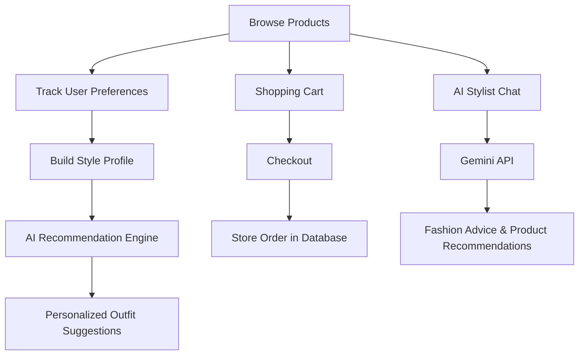

# 👗 Vogue Trends

An AI-powered fashion e-commerce platform built with the **MERN Stack** that delivers personalized shopping experiences through an intelligent styling assistant, outfit recommendations, and a modern admin dashboard.

---

## ✨ Features

### 🛍️ Shopping Experience
- Modern responsive fashion storefront
- Product search and advanced filtering
- Shopping cart and wishlist
- Product reviews and ratings
- Secure user authentication
- Order history and tracking

### 🤖 AI Features
- AI Stylist powered by **Google Gemini 2.5 Flash**
- Personalized outfit recommendations
- Style preference analysis based on browsing behavior
- Context-aware fashion assistant
- Color palette and style matching

### 👤 User Personalization
- Dynamic style profile
- Personalized recommendations
- Wishlist synchronization
- Persistent shopping cart
- Order management

### 🛠️ Admin Dashboard
- Product management (Create, Update, Delete)
- Order management
- Sales analytics
- Inventory management
- Customer order tracking

---

## 🏗️ Tech Stack

### Frontend
- React
- Vite
- Tailwind CSS
- React Router

### Backend
- Node.js
- Express.js
- MongoDB Atlas
- Mongoose
- JWT Authentication

### AI
- Google Gemini API (`gemini-2.5-flash`)

---

## 📖 How It Works



---

## 🔑 Admin Access

Demo administrator credentials:

| Field | Value |
|-------|-------|
| Username / Email | `user` |
| Password | `user123` |

After logging in:

- Product Management
- Order Management
- Sales Dashboard
- Inventory Controls

become available from the Admin Portal.

---

# 🚀 Getting Started

## Prerequisites

- Node.js 20+
- npm
- Google Gemini API Key
- MongoDB Atlas (recommended)

---

## Installation

Clone the repository:

```bash
git clone https://github.com/yourusername/vogue-trends.git
cd vogue-trends
```

Install dependencies:

```bash
npm install
```

---

## Environment Variables

Create a `.env.local` file in the project root.

```env
GEMINI_API_KEY=your_gemini_api_key

JWT_SECRET=your_jwt_secret

MONGO_URI=your_mongodb_connection_string
```

---

## Running the Project

Start the development server:

```bash
npm run dev
```

The application will start with both the frontend and backend development servers.

---

# 🗄️ Database

The application supports two storage modes.

### MongoDB (Recommended)

If `MONGO_URI` is provided, all data is stored in MongoDB Atlas.

### Local Storage Fallback

If a MongoDB connection is not available, the application automatically saves data to the local storage file:

```
local_database.json
```

> **Note**
>
> Local storage is intended only for development. It should not be used in production deployments.

---

# 📦 Production Build

Build the frontend:

```bash
npm run build
```

Run the production server:

### Windows (PowerShell)

```powershell
$env:NODE_ENV="production"
npm start
```

### Linux / macOS

```bash
NODE_ENV=production npm start
```

---

# 📁 Project Structure

```
├── client/
├── server/
│   ├── controllers/
│   ├── models/
│   ├── routes/
│   ├── middleware/
│   └── config/
├── public/
├── dist/
├── local_database.json
└── README.md
```

---

# 🌐 Deployment

The application can be deployed to platforms such as:

- Vercel (Frontend)
- Render
- Railway
- DigitalOcean
- AWS
- Azure

For production deployments:

- Configure `MONGO_URI`
- Configure `JWT_SECRET`
- Configure `GEMINI_API_KEY`

---

# 📸 Screenshots

> Add screenshots of:
>
> - Home Page
> - Product Catalog
> - AI Stylist
> - Outfit Recommendations
> - Cart
> - Checkout
> - Admin Dashboard

---

# 📄 License

This project is intended for educational and portfolio purposes.
